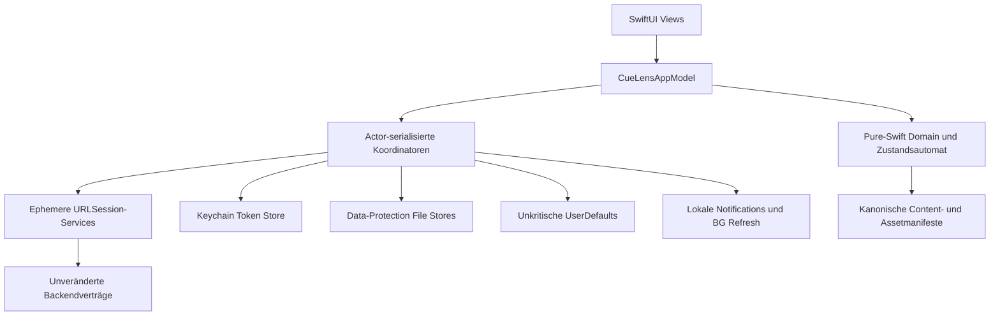

# CueLens iOS – implementierte Architektur

Stand: Source Candidate `e66270a93a74fa435af03a8b2054f8f8738756cf`.

## Abhängigkeits- und Datenschutzgrenzen

- Die Domain importiert weder SwiftUI/UIKit noch Netzwerk-, Keychain- oder Notification-Frameworks.
- Views greifen nicht direkt auf Netzwerk, Keychain oder Dateien zu. Das AppModel veröffentlicht ausschließlich UI-relevante Zustände.
- App-Token und Aktivierungs-Recovery sind von dem atomar geschützten Studienzustand getrennt. Nicht sensitive Spracheinstellungen und positive Nachrichten-IDs liegen separat in `UserDefaults`.
- Der zentrale HTTP-Client lehnt Redirects ab, begrenzt Antworten während des Empfangs und protokolliert nur Requesttyp, Status und abstrakte Fehlerkategorie.
- Trialauswahlen und Reaktionszeiten verlassen die flüchtige Session nicht. Persistiert und übertragen wird beim Selbstbericht ausschließlich der bestehende ganzzahlige Craving-Wert zusammen mit Token und unveränderter App-Version.
- Die iOS-Portierung ist eine technische Plattformergänzung. Studienbedingungen, zwanzig Selbstberichte, Reize, Backendvertrag und Auswertung bleiben unverändert; nur die konkrete zulässige Zufallsfolge kann plattformspezifisch sein.

Die technische Datenherkunft und die Speicherorte sind ergänzend in `APP_PRIVACY_DATA_FLOW_MATRIX.md`, die Anforderungsabdeckung in `IOS_FUN_TRACEABILITY_MATRIX.md` dokumentiert.
