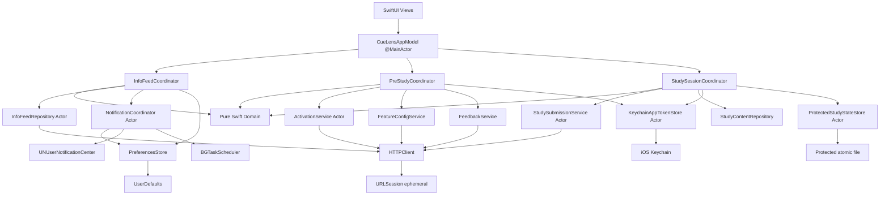
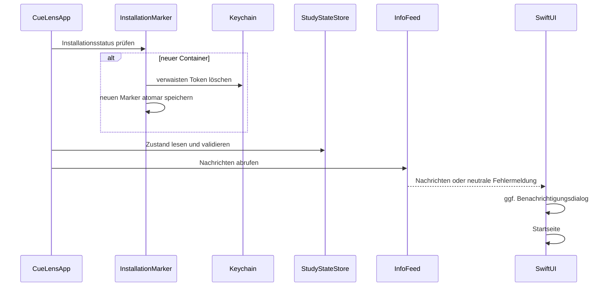

# CueLens – iOS-Architektur, Implementierungsplan, Teststrategie und Definition of Done

## Dokumentstatus

| Feld | Wert |
|---|---|
| Dokumenttyp | Plattformspezifische Architektur- und Implementierungsplanung |
| Produkt | CueLens |
| Zielplattform | iOS und iPadOS |
| Bundle Identifier | `de.eachandevery.cuelens` |
| Empfohlener Repository-Pfad | `cuelens-ios/IOS_ARCHITECTURE_AND_IMPLEMENTATION_PLAN.md` |
| Empfohlener Projektpfad | `cuelens-ios/` |
| Dokumentversion | 1.0.1 |
| Status | Verbindliche Planung für die native iOS-Portierung |
| Stand | 15. August 2026 |
| Referenzimplementierung | Android-App `de.eachandevery.cuelens` |
| Referenz-Commit | `main`, Commit `9ef5f38ee341a0f59a1b2844773c8cadc8a807c2` |
| Übergeordnete Spezifikation | `cuelens-ios/PLATFORM_INDEPENDENT_SPECIFICATION.md`, Version 1.0.1 |
| Nicht enthalten | `AI_PoC`, Kamera, Fotos, Bildklassifikation, Core ML, LiteRT und spätere KI-Major-Version |

Dieses Dokument konkretisiert die plattformunabhängige CueLens-Spezifikation für eine native iOS- und iPadOS-App. Die plattformunabhängige Spezifikation besitzt Vorrang. Widerspricht eine technische Einzelentscheidung dieses Dokuments einer dort festgelegten fachlichen, studienmethodischen, datenschutzbezogenen oder sicherheitstechnischen Anforderung, MUSS die technische Entscheidung korrigiert werden.

Die vorhandene Android-App und das vorhandene PHP-Hintergrundsystem bleiben Referenz und werden durch diese Portierung nicht funktional erweitert. Insbesondere werden das Backend-Protokoll, das Studienablaufschema, die wissenschaftlich gespeicherten Daten und die vorgesehene Auswertung nicht geändert.

Für die Masterarbeit ist zwischen **Planung** und **umgesetztem Stand** zu unterscheiden. Architekturentscheidungen, Testfälle und Arbeitspakete dürfen erst dann als implementiert beschrieben werden, wenn die zugehörigen Definition-of-Done-Kriterien nachweislich erfüllt sind.

---

## 1. Normative Begriffe

- **MUSS**: zwingend umzusetzen.
- **DARF NICHT**: unter keinen Umständen zulässig.
- **SOLL**: umzusetzen, sofern kein dokumentierter technischer oder methodischer Grund entgegensteht.
- **KANN**: optionale, mit der Spezifikation vereinbare Umsetzung.
- **Codex-Auftrag**: klar abgegrenztes Arbeitspaket, das in einem eigenen Branch beziehungsweise Worktree und in einem eigenen Pull Request umgesetzt wird.
- **Review-Gate**: Voraussetzung, die vor Beginn des nächsten Codex-Auftrags menschlich geprüft und freigegeben werden muss.
- **Produktionscode**: Quellcode, der in einem Release- oder TestFlight-Build enthalten ist.
- **Kritischer Zustand**: App-Token, ausstehender Rauchverlangenswert, bestätigter Studienfortschritt oder Studienabschluss.
- **Fail-closed**: bei unklarem oder ungültigem Zustand wird keine produktive Studienaktion zugelassen.
- **Best effort**: eine vom Betriebssystem nicht garantierte Hintergrundfunktion, deren Ausbleiben keine Datenintegrität oder Studienfortsetzung gefährden darf.

---

## 2. Ziele und Nicht-Ziele

### 2.1 Ziele

Die iOS-Portierung MUSS:

1. alle Funktionen der aktuellen CueLens-Studien-App nativ auf iOS und iPadOS bereitstellen;
2. das bestehende Studiendesign unverändert realisieren;
3. dieselben Backend-Endpunkte und JSON-Verträge verwenden;
4. dieselben Reizbilder und Cue-Label-Zuordnungen verwenden;
5. denselben datensparsamen wissenschaftlichen Datensatz erzeugen;
6. die Sicherheits-, Datenschutz- und Stabilitätseigenschaften der Android-App mindestens gleichwertig übertragen;
7. iOS-typische Sicherheitsmechanismen wie Keychain, Data Protection, App Transport Security und geschützte App-Vorschauen nutzen;
8. ohne Drittanbieter-Analyse-, Werbe-, Tracking- oder Crash-Reporting-SDKs auskommen;
9. mit Codex in prüfbaren, kleinen und testbaren Schritten umgesetzt werden;
10. für die Masterarbeit eine nachvollziehbare Trennung zwischen plattformunabhängigem Protokoll und plattformspezifischer Realisierung ermöglichen.

### 2.2 Nicht-Ziele

Nicht Bestandteil dieser Portierung sind:

- eine KI-gestützte Major-Version;
- `AI_PoC`;
- Kamera- oder Fotomediathekzugriff;
- eigene Bilder der Teilnehmenden;
- On-Device-Inferenz;
- Core ML, Vision, TensorFlow Lite oder LiteRT;
- Plattformvergleich oder Plattformvariable in Forschungsdaten;
- Änderung der statistischen Auswertung;
- Änderung der Bedingungsreihenfolge;
- neue Forschungsendpunkte;
- serverseitige API-Versionierung;
- Request-IDs oder ein neues Idempotenzprotokoll;
- APNs-basierte Push-Infrastruktur;
- In-App-Widerruf oder In-App-Löschung;
- erneute In-App-Zustimmung zur Datenschutzerklärung auf iOS;
- Änderungen an Android-App oder Backend als technische Voraussetzung der iOS-App.

---

## 3. Technische Zielbasis

### 3.1 Grundentscheidungen

| Bereich | Verbindliche Entscheidung |
|---|---|
| Implementierungsart | native App |
| Sprache | Swift |
| UI | SwiftUI |
| Nebenläufigkeit | Swift Concurrency mit `async`/`await`, `actor` und `@MainActor` |
| Mindestziel | iOS 17.0 und iPadOS 17.0 |
| Geräte | iPhone und iPad |
| Ausrichtung | ausschließlich Hochformat |
| iPad-Multitasking | deaktiviert; App läuft vollflächig |
| Xcode | jeweils aktuelle stabile, für App Store Connect zugelassene Version |
| Swift-Sprachmodus | aktueller stabiler Modus mit vollständigen Strict-Concurrency-Prüfungen |
| Drittanbieterabhängigkeiten | keine |
| Netzwerk | `URLSession` mit ephemerer Konfiguration |
| sicherer Tokenstore | Keychain Services |
| sensibler Studienzustand | atomar gespeicherte, dateigeschützte Codable-Datei |
| unkritische Einstellungen | `UserDefaults` |
| Benachrichtigungen | `UserNotifications` |
| Studienerinnerung | lokale zeitbasierte Benachrichtigung |
| Informationsprüfung im Hintergrund | `BGAppRefreshTask`, best effort |
| Logging | `OSLog.Logger` mit ausschließlich nicht sensitiven Ereignissen |
| Tests | XCTest und XCUITest |
| Distribution | zunächst interne Tests, danach TestFlight und App Store |
| Bundle Identifier Release | `de.eachandevery.cuelens` |
| Bundle Identifier Staging | `de.eachandevery.cuelens.staging` |

### 3.2 Begründung des Mindestziels

iOS/iPadOS 17.0 ist der anfängliche Deployment Target. Diese Festlegung:

- ermöglicht eine moderne SwiftUI- und Swift-Concurrency-Architektur ohne umfangreiche Kompatibilitätsschichten;
- unterstützt weiterhin eine breite Gerätebasis;
- reduziert Testaufwand gegenüber sehr alten Betriebssystemen;
- vermeidet eine unnötige Erhöhung der Zugangshürde auf die jeweils neueste iOS-Hauptversion.

Eine Absenkung auf iOS 16 DARF nur nach einem separaten Kompatibilitätssprint erfolgen. Eine Anhebung DARF nur nach dokumentierter Prüfung der Auswirkungen auf die Rekrutierung erfolgen.

### 3.3 Hochformat auf iPad

Da das Studiendesign eine kontrollierte Hochformatdarstellung vorsieht, MUSS die iPad-App:

- ausschließlich `UIInterfaceOrientationPortrait` unterstützen;
- als Full-Screen-App konfiguriert werden;
- iPad-Multitasking und Stage-Manager-Mehrfensterdarstellung für diese Version nicht unterstützen;
- dieselbe logische Vollbild-Reizdarstellung wie die iPhone-App bieten.

---

## 4. Architekturprinzipien

### 4.1 Vorrang der Studienintegrität

UI-Komfort und zusätzliche Funktionen sind nachrangig gegenüber:

1. korrekter Bedingungsreihenfolge;
2. vollständiger Reizdarstellung;
3. korrekter Wartezeit;
4. korrektem Rauchverlangenswert;
5. persistenter Erkennung ausstehender Übertragungen;
6. strikter Validierung der Serverantwort;
7. korrektem Abschlusszustand.

### 4.2 Security und Privacy by Default

- Produktionskommunikation ist ausschließlich per HTTPS zulässig.
- App Transport Security bleibt ohne globale Ausnahmen aktiv.
- Der App-Token wird nur im Keychain gespeichert.
- Sensible Zustandsdateien sind mit vollständigem Dateischutz versehen und aus Backups ausgeschlossen.
- Keine Daten werden in iCloud, CloudKit oder App Groups synchronisiert.
- Keine Analyse-, Werbe- oder Tracking-SDKs werden integriert.
- Keine Berechtigungen für Kamera, Fotos, Mikrofon, Standort, Kontakte, Kalender oder Bluetooth werden angefordert.
- Keine personenbezogenen oder gesundheitlichen Werte erscheinen in Logs, Benachrichtigungen oder App-Switcher-Vorschauen.
- Die Plattform wird nicht als fachliches Feld übertragen oder gespeichert.

### 4.3 Fail-closed für kritische Zustände

Die produktive Studie bleibt gesperrt, wenn:

- der App-Token nicht sicher gelesen werden kann;
- der lokale Studienzustand nicht dekodiert oder validiert werden kann;
- ein ausstehender Selbstbericht vorliegt;
- eine Abschlussbestätigung aussteht;
- die Feature-Konfiguration nicht eindeutig `true` liefert;
- die Serverantwort nicht dem erwarteten Schema entspricht;
- erforderliche Studienassets fehlen.

### 4.4 Hintergrundfunktionen sind nicht autoritativ

Weder eine Erinnerung noch die Hintergrundprüfung des Informationsfeeds darf Voraussetzung für die Studiendurchführung sein. Beim Öffnen beziehungsweise Aktivieren der App werden Feed, Berechtigungen, lokaler Studienzustand und Feature-Konfiguration erneut geprüft.

### 4.5 Kleine, auditierbare Datenstrukturen

Der lokale Studienzustand umfasst nur wenige skalare Werte und eine Permutation von maximal 50 Indizes. Eine relationale lokale Datenbank ist dafür nicht erforderlich. Eine vollständig atomar geschriebene Codable-Datei ist:

- einfacher zu prüfen;
- leichter mit Zustandsinvarianten zu validieren;
- weniger fehleranfällig bei Migrationen;
- ressourcenschonender;
- ausreichend für das bestehende Datenvolumen.

### 4.6 Keine erzwungene plattformübergreifende Randomisierung

iOS verwendet `SystemRandomNumberGenerator`. Die konkrete Reihenfolge muss nicht mit Android übereinstimmen. Verbindlich sind ausschließlich:

- vollständige Permutation der 50 Cue-Matching-Items;
- genau fünf Items je Cue-Matching-Durchgang;
- jedes Matching-Item genau einmal;
- zufällige Position der beiden Matching-Optionen;
- zufällige Position der beiden Labeloptionen.

---

## 5. Architekturübersicht



### 5.1 Abhängigkeitsregel

Abhängigkeiten dürfen nur nach innen zeigen:

```text
SwiftUI → Application/Coordinator → Domain ← Infrastructure implementations
```

Das Domain-Modul DARF NICHT importieren:

- SwiftUI;
- UIKit;
- Security;
- UserNotifications;
- BackgroundTasks;
- OSLog;
- konkrete Netzwerk- oder Persistenzklassen.

Dadurch können Studienlogik, Parser und Zustandsinvarianten ohne Simulator und ohne Betriebssystemdienste getestet werden.

### 5.2 Composition Root

Die Datei `CueLensApp.swift` beziehungsweise ein separater `AppEnvironment` bildet den einzigen Composition Root. Dort werden konkrete Implementierungen erzeugt und über Protokolle injiziert.

Views DÜRFEN NICHT selbst:

- `URLSession` aufrufen;
- Keychain lesen;
- Dateien schreiben;
- `UserDefaults.standard` direkt verwenden;
- Benachrichtigungen planen;
- Studienfortschritt verändern.

---

## 6. Empfohlene Repository- und Projektstruktur

```text
cuelens/                         # bestehendes Android-Studio-Projekt
cuelens-ios/                     # eigenständiges iOS-Geschwisterprojekt
  PLATFORM_INDEPENDENT_SPECIFICATION.md
  IOS_ARCHITECTURE_AND_IMPLEMENTATION_PLAN.md
  AGENTS.md
  CODEX_IMPLEMENTATION_LOG.md
  README.md

  Resources/
    Study/
      Assets/
      study-content-v1.json
      study-assets-manifest-v1.json

  Schemas/
    study-content-v1.schema.json
    study-assets-manifest-v1.schema.json

  Fixtures/
    activation/
    messages/
    features/
    feedback/
    submission/

  Tools/
    requirements-dev.txt
    generate_study_resources.py
    verify_study_resources.py

  CueLens.xcodeproj/
  Config/
    Base.xcconfig
    Debug.xcconfig
    Staging.xcconfig
    Release.xcconfig

  CueLens/
    App/
      CueLensApp.swift
      AppEnvironment.swift
      CueLensAppModel.swift
      AppRoute.swift
      PrivacyCurtain.swift

    Domain/
      Common/
      Activation/
      InfoFeed/
      Notifications/
      PreStudy/
      Study/
      Completion/
      Validation/

    Features/
      InfoFeed/
      NotificationConsent/
      Home/
      Activation/
      Demo/
      Feedback/
      ProductiveStudy/
      Completion/

    Infrastructure/
      Configuration/
      Network/
      Keychain/
      Persistence/
      Notifications/
      BackgroundTasks/
      Logging/

    Resources/
      Assets.xcassets/
      Localizable.xcstrings
      StudyContent/
      PrivacyInfo.xcprivacy
      Info.plist

  CueLensTests/
    Domain/
    Network/
    Persistence/
    Notifications/
    Fixtures/

  CueLensUITests/
    AppLaunch/
    InfoFeed/
    Activation/
    Demo/
    Feedback/
    Study/
    Accessibility/

  Scripts/
    verify_release_configuration.sh
    select_ci_simulator.sh
```

### 6.1 `AGENTS.md`

`cuelens-ios/AGENTS.md` MUSS Codex mindestens folgende Grenzen vorgeben:

- `../cuelens/`, `../AI_PoC/` und `../cuelens.each-and-every.de/` nicht ändern;
- keine Drittanbieterpakete zur App oder zum Produktionscode ergänzen; gepinnte Entwicklungswerkzeuge unter `Tools/` sind zulässig;
- keine Kamera-, Foto-, Mikrofon-, Standort- oder Trackingberechtigung ergänzen;
- kein Plattformfeld in Requests ergänzen;
- keine echten Teilnehmerdaten in Tests oder Logs verwenden;
- Markdown-Protokolle nur ergänzen, nicht stillschweigend überschreiben;
- jede Änderung mit Tests und einem Eintrag im Implementierungslog abschließen;
- keine Produktiv-URLs außerhalb der `.xcconfig`-Dateien duplizieren;
- keine Force-Unwraps, `try!` oder erzwungenen Casts im Produktionscode;
- keine Netzwerk-, Keychain- oder Dateizugriffe direkt aus Views.

### 6.2 Append-only-Implementierungslog

`CODEX_IMPLEMENTATION_LOG.md` wird nur ergänzt. Jeder Auftrag fügt einen Abschnitt hinzu:

```text
Datum und Commit
Auftragsnummer
Ziel
Geänderte Dateien
Ausgeführte Tests
Testergebnis
Sicherheits-/Datenschutzprüfung
Abweichungen von der Planung
Offene Punkte
Menschliche Freigabe
```

---

## 7. Verbindliches Zustands- und Nebenläufigkeitsmodell

### 7.1 Hauptmodell

`CueLensAppModel` ist `@MainActor`-isoliert und enthält ausschließlich darstellungsrelevanten Zustand. Es koordiniert die Feature-Module, enthält aber keine kryptographische, persistente oder HTTP-spezifische Implementierung.

```swift
@MainActor
final class CueLensAppModel: ObservableObject {
    @Published private(set) var route: AppRoute = .loading
    @Published private(set) var language: AppLanguage = .german
    @Published private(set) var notice: UserNotice?
}
```

### 7.2 Serielle Infrastruktur

Folgende Komponenten SOLLEN als `actor` umgesetzt werden:

- `KeychainAppTokenStore`;
- `ProtectedStudyStateStore`;
- `ActivationService`;
- `StudySubmissionService`;
- `NotificationCoordinator`;
- `InfoFeedRepository`, sofern Lese- und Schreibvorgänge kombiniert werden.

Damit werden parallele Doppelaufrufe verhindert, ohne UI-Schichten mit Locks zu belasten.

### 7.3 Routing

```swift
enum AppRoute: Equatable {
    case loading
    case infoFeed
    case notificationConsent
    case home
    case activation
    case demo(DemoStep)
    case feedback
    case productiveStudy
}

enum DemoStep: Equatable {
    case cueMatching
    case cueLabeling
    case craving
    case completed
}

enum StudyPhase: Equatable {
    case startGate
    case cueMatching(trialIndex: Int)
    case cueLabeling(trialIndex: Int)
    case craving
    case transferring
    case completed
}
```

### 7.4 Kritische Aktionen

Folgende Aktionen müssen serialisiert und gegen Doppel-Taps geschützt werden:

- Aktivierungsanforderung;
- Aktivierungsbestätigung;
- Feedbackübertragung;
- Selbstberichtübertragung;
- Kompensationscodebestätigung;
- Schreiben des kritischen Studienzustands;
- Planen beziehungsweise Abgleichen einer Studienerinnerung.

---

## 8. Domänenmodell und Schnittstellen

### 8.1 Zentrale Protokolle

```swift
protocol AppTokenStore: Sendable {
    func readToken() async throws -> UUID?
    func saveToken(_ token: UUID) async throws
    func clearToken() async throws
}

protocol StudyStateStore: Sendable {
    func readState() async throws -> StudyState
    func writeState(_ state: StudyState) async throws
}

protocol ActivationServicing: Sendable {
    func requestToken(identifier: ParticipantIdentifier) async throws -> UUID
    func confirmToken(identifier: ParticipantIdentifier, token: UUID) async throws
}

protocol FeatureConfigServicing: Sendable {
    func isNextStudyRunEnabled() async -> Bool
}

protocol FeedbackServicing: Sendable {
    func submit(source: String?, comment: String?, appVersion: String) async throws
}

protocol StudySubmissionServicing: Sendable {
    func submitSelfReport(token: UUID, craving: Int) async throws -> SelfReportResponse
    func confirmCompensation(code: UUID) async throws
}

protocol InfoFeedServicing: Sendable {
    func fetchMessages() async throws -> [InfoMessage]
}
```

### 8.2 Teilnehmerkennung

```swift
enum ParticipantIdentifier: Equatable, Sendable {
    case directEmail(String)
    case prolificID(String)
}
```

Validierung MUSS dem Android-Client entsprechen:

```text
Prolific-ID: ^[A-Za-z0-9]{24}$
E-Mail:      ^[^\s@]+@[^\s@]+\.[^\s@]+$
```

Die Kennung bleibt nur im View-/Requestspeicher und wird nach erfolgreicher Aktivierung verworfen.

### 8.3 Studienfortschritt

```swift
struct StudyState: Codable, Equatable, Sendable {
    var schemaVersion: Int
    var confirmedSituationCount: Int
    var nextSituationAvailableAt: Date?
    var lastNotifiedSituationNumber: Int
    var matchingOrder: [Int]
    var pendingCraving: Int?
    var completion: CompletionState
}

enum CompletionState: Codable, Equatable, Sendable {
    case incomplete
    case invalid
    case directPendingConfirmation(code: UUID)
    case directCompleted(code: UUID)
    case prolificCompleted
}
```

Jeder Lese- und Schreibvorgang MUSS die Invarianten der plattformunabhängigen Spezifikation prüfen.

### 8.4 Studieninhalt

`study-content-v1.json` ist die kanonische iOS-Eingabe für:

- 50 Cue-IDs;
- 50 Matching-A-IDs;
- 50 Matching-B-IDs;
- 50 deutsche Labelpaare;
- 50 englische Labelpaare;
- Demo-IDs.

Beispiel:

```json
{
  "version": 1,
  "matching": [
    {
      "index": 0,
      "cue": "cue_000",
      "match_a": "match_a_000",
      "match_b": "match_b_000"
    }
  ],
  "labeling": [
    {
      "index": 0,
      "cue": "cue_000",
      "de": {
        "fitting": "Rauchschleier",
        "less_fitting": "Abendlicht"
      },
      "en": {
        "fitting": "smoke haze",
        "less_fitting": "evening light"
      }
    }
  ]
}
```

Die iOS-App DARF nicht mit einem unvollständigen, doppelten oder inkonsistenten Content-Manifest starten. Die Demo darf weiterhin funktionieren, wenn nur produktive Ressourcen fehlen; der produktive Start bleibt dann fail-closed.

---

## 9. Persistenz- und Schutzkonzept

### 9.1 Speicherklassen

| Daten | Speicher | Schutz | Backup |
|---|---|---|---|
| App-Token | Keychain Generic Password | `kSecAttrAccessibleWhenUnlockedThisDeviceOnly` | nicht migrierbar |
| Installationsmarker | `Library/Application Support/CueLens/installation-v1` | vollständiger Dateischutz | ausgeschlossen |
| Studienzustand | `Library/Application Support/CueLens/study-state-v1.json` | vollständiger Dateischutz | ausgeschlossen |
| Sprache | `UserDefaults` | unkritische Einstellung | keine Gesundheitsdaten |
| Nachrichten-IDs | `UserDefaults` | unkritische positive IDs | keine Nachrichtentexte |
| Benachrichtigungspräferenz | `UserDefaults` | unkritische Einstellung | keine Gesundheitsdaten |
| Formularwerte | nur Arbeitsspeicher | Lebensdauer der View | nicht persistent |
| Demo-Werte | nur Arbeitsspeicher | Lebensdauer der Demo | nicht persistent |

### 9.2 Keychain-Konfiguration

Der App-Token wird als Generic Password gespeichert:

```text
class:       kSecClassGenericPassword
service:     de.eachandevery.cuelens
account:     app-token-v1
accessible:  kSecAttrAccessibleWhenUnlockedThisDeviceOnly
sync:        false
accessGroup: Standardgruppe der App; keine gemeinsame Gruppe
```

Zusätzliche Anforderungen:

- keine biometrische Pflicht;
- kein Shared Web Credential;
- keine App Group;
- kein Secure-Enclave-Zwang, da ein kleiner symmetrischer Credential-Wert und kein privater Schlüssel gespeichert wird;
- UUID-v4-Validierung bei jedem Lesen;
- unbekannter Keychain-Status führt zu `secureStorageFailure`;
- ein leerer oder formal ungültiger Wert wird nicht still gelöscht, sondern als Sicherheitsfehler behandelt;
- ein Speichervorgang gilt nur bei `errSecSuccess` als erfolgreich.

### 9.3 Bindung an die Installation

Keychain-Einträge können technische Lebenszyklen besitzen, die nicht identisch mit dem App-Container sind. Deshalb wird ein installationsgebundener Marker verwendet:

1. Beim ersten Start wird geprüft, ob der geschützte Installationsmarker existiert.
2. Fehlt der Marker, wird ein eventuell vorhandener CueLens-Keychain-Token als verwaist betrachtet und gelöscht.
3. Danach wird ein neuer zufälliger Installationsmarker atomar angelegt.
4. Bei normalen App-Updates bleibt der Marker erhalten.
5. Bei beschädigtem Marker oder fehlgeschlagenem Löschen wird fail-closed verfahren.

Damit kann ein alter Token nach einer vollständigen Neuinstallation nicht unkontrolliert wiederverwendet werden.

### 9.4 Geschützter Studienzustand

Der kritische Studienzustand wird als kleine Codable-Datei gespeichert:

```text
Library/Application Support/CueLens/study-state-v1.json
```

Schreibvorgang:

1. Domäneninvarianten prüfen.
2. deterministisch JSON-encodieren;
3. mit atomarer Schreiboption in eine temporäre Datei schreiben;
4. vollständigen Dateischutz setzen;
5. Datei beziehungsweise Verzeichnis aus Backups ausschließen;
6. erst nach erfolgreichem Abschluss den neuen Zustand im UI veröffentlichen.

Die Implementierung SOLL `Data.write(options: [.atomic, .completeFileProtection])` beziehungsweise die aktuelle gleichwertige Foundation-API verwenden.

### 9.5 Lesefehler und Migration

- Nicht vorhandene Datei: Initialzustand.
- Bekannte ältere Schema-Version: explizite, getestete Migration.
- Unbekannte neuere Schema-Version: fail-closed.
- JSON-Fehler: fail-closed.
- Invariantenverletzung: `CompletionState.invalid`.
- Es gibt keinen automatischen Reset, weil dadurch ausstehende wissenschaftliche Daten oder Abschlussinformationen verloren gehen könnten.
- Die UI zeigt eine neutrale Fehlermeldung und den Supportkontakt.

### 9.6 `UserDefaults`

`UserDefaults` darf nur für folgende Daten verwendet werden:

- Sprache;
- Benachrichtigungsdialog bereits abgeschlossen;
- Benachrichtigungen intern aktiviert;
- bekannte Nachrichten-IDs;
- dauerhaft ausgeblendete Nachrichten-IDs.

Nicht zulässig in `UserDefaults`:

- App-Token;
- E-Mail-Adresse;
- Prolific-ID;
- Craving;
- Kompensationscode;
- bestätigter Studienfortschritt;
- Matching-Reihenfolge.

---

## 10. Netzwerkarchitektur

### 10.1 HTTP-Client

Es gibt genau einen zentralen `HTTPClient`. Er verwendet:

```swift
let configuration = URLSessionConfiguration.ephemeral
configuration.urlCache = nil
configuration.httpCookieStorage = nil
configuration.requestCachePolicy = .reloadIgnoringLocalCacheData
configuration.timeoutIntervalForRequest = 15
configuration.timeoutIntervalForResource = 30
configuration.waitsForConnectivity = false
```

Begründung:

- keine persistente Speicherung von Cookies, Credentials oder Responses;
- kurze, interaktive Requests;
- schneller, kontrollierter Fehler statt unbestimmten Wartens;
- ausstehende Studienwerte bleiben lokal erhalten.

### 10.2 App Transport Security

Release:

- keine `NSAllowsArbitraryLoads`;
- keine `NSAllowsArbitraryLoadsInWebContent`;
- keine `NSAllowsArbitraryLoadsForMedia`;
- keine HTTP-Ausnahme für Produktionsdomains;
- systemseitige Zertifikats- und Hostnamenprüfung;
- keine benutzerdefinierte Trust-Akzeptanz.

Staging:

- SOLL ebenfalls HTTPS verwenden;
- falls lokale Entwicklung zwingend HTTP benötigt, darf nur die Staging-Konfiguration eine eng begrenzte Ausnahme enthalten;
- eine solche Ausnahme DARF NICHT in Release-Artefakte gelangen;
- `NSAllowsArbitraryLoads = true` ist auch in Staging unzulässig.

### 10.3 Kein Certificate Pinning in Version 1

Certificate Pinning wird in dieser Portierung nicht eingeführt. Gründe:

- die Android-Referenz nutzt kein Pinning;
- das bestehende Betriebsmodell benötigt reguläre Zertifikatsrotation;
- fehlerhaftes oder nicht rotierbares Pinning würde die Studienverfügbarkeit gefährden;
- ATS und die System-Trust-Evaluation bieten die angestrebte Sicherheitsäquivalenz.

Eine spätere Einführung erfordert ein eigenes Rotations- und Notfallkonzept.

### 10.4 Gemeinsame Request-Header

```text
Content-Type: application/json; charset=UTF-8   (schreibende JSON-Requests)
Accept: application/json, */*;q=0.8
Accept-Charset: UTF-8, *;q=0.5
Accept-Language: de, en;q=0.8, *;q=0.5
Accept-Encoding: identity
User-Agent: CueLens/<CFBundleShortVersionString>
```

Der User-Agent enthält keine Plattformbezeichnung, Gerätemodell- oder OS-Angabe.

### 10.5 Redirects

Die Endpunkte werden direkt adressiert. HTTP-Redirects SOLLEN abgelehnt werden. Mindestens Redirects zu:

- einer anderen Domain;
- HTTP statt HTTPS;
- einem nicht konfigurierten Pfad

MÜSSEN abgelehnt werden.

### 10.6 Antwortgrößen

Der Client MUSS eine maximale Antwortgröße erzwingen:

| Endpunkt | Empfohlenes Maximum |
|---|---:|
| Aktivierung | 8 KiB |
| Feature-Konfiguration | 8 KiB |
| Selbstbericht | 16 KiB |
| Informationsfeed | 512 KiB |
| Feedback | 8 KiB, regulär leer |
| Kompensationsbestätigung | 8 KiB, regulär leer |

Eine Überschreitung wird als Protokollfehler behandelt.

### 10.7 Fehlerklassen

```swift
enum NetworkError: Error, Equatable {
    case invalidConfiguration
    case offline
    case timedOut
    case cancelled
    case redirectRejected
    case invalidTLS
    case httpStatus(Int)
    case invalidContentType
    case bodyTooLarge
    case malformedJSON
    case protocolViolation
}
```

Feature-Konfiguration mappt sämtliche Fehler auf `false`. Andere Services propagieren eine fachlich geeignete Fehlerklasse an den Coordinator.

### 10.8 Strikte Servervalidierung

- UUIDs werden als UUID-v4 geprüft, nicht nur als beliebige UUID.
- Integerfelder dürfen keine Fließkommazahl darstellen.
- Boolesche Felder müssen echte JSON-Booleans sein.
- `situation_index` und `condition_code` werden gemeinsam validiert.
- Abschlussantworten besitzen nur die jeweils zulässige Kombination aus `status`, `completion_mode` und `compensation_code`.
- Ein 2xx-Status ohne gültigen fachlichen Payload gilt nicht als Erfolg.
- Fehlerantworten werden nicht roh geloggt.

### 10.9 Plattform- und Datensparsamkeitsregel

Kein iOS-Request darf ein zusätzliches Feld für:

- Plattform;
- Gerätemodell;
- OS-Version;
- Installations-ID;
- Push-Token;
- Sprache;
- Zeitzone;
- Zeitstempel

enthalten, sofern es nicht bereits Teil des bestehenden Vertrags ist. Insbesondere bleibt das Selbstberichtpayload auf `app_token`, `craving` und `app_version` beschränkt.

### 10.10 Akzeptiertes Restrisiko des unveränderten Protokolls

Die Portierung führt bewusst keine neue Request-ID und keine serverseitige Idempotenzschicht ein. Bei einem Netzwerkabbruch nach serverseitiger Speicherung, aber vor Erhalt der Antwort, kann der Client den Ausgang nicht sicher feststellen. Das iOS-Verhalten MUSS der Android-Referenz folgen:

- Pending-Wert erhalten;
- Retry zulassen beziehungsweise beim Recovery versuchen;
- unerwarteten Situationindex als Protokollfehler erkennen;
- lokalen Fortschritt nicht erhöhen;
- keinen neuen Durchgang zulassen.

Dieses Restrisiko wird in der technischen Diskussion der Masterarbeit transparent als Eigenschaft des übernommenen Protokolls beschrieben.

---

## 11. App-Konfiguration und Build-Varianten

### 11.1 `.xcconfig`

Endpunkte und Cooldown werden ausschließlich in `.xcconfig` definiert.

```text
Base.xcconfig
- PRODUCT_BUNDLE_IDENTIFIER
- MARKETING_VERSION
- CURRENT_PROJECT_VERSION
- IPHONEOS_DEPLOYMENT_TARGET

Staging.xcconfig
- CUELENS_ACTIVATION_URL
- CUELENS_MESSAGES_URL
- CUELENS_FEEDBACK_URL
- CUELENS_FEATURES_URL
- CUELENS_SUBMIT_URL
- CUELENS_PRIVACY_URL_DE
- CUELENS_PRIVACY_URL_EN
- CUELENS_RUN_COOLDOWN_SECONDS = 3

Release.xcconfig
- dieselben Produktions-URLs wie Android
- CUELENS_RUN_COOLDOWN_SECONDS = 10800
```

### 11.2 Secrets

Im iOS-Repository werden keine Secrets gespeichert. Insbesondere nicht:

- Datenbankkennwörter;
- HMAC-Secrets;
- SMTP-Zugangsdaten;
- Apple-Distribution-Zertifikate;
- App-Store-Connect-API-Schlüssel;
- echte Teilnehmendenkennungen;
- echte App-Tokens.

### 11.3 Release-Härtung

Release MUSS:

- Optimierung aktivieren;
- Debug- und Testcode ausschließen;
- keine Staging-URLs enthalten;
- keine ATS-Ausnahmen enthalten;
- keine Test-Entitlements enthalten;
- Assertions und interne Diagnoseansichten nicht nutzbar machen;
- ein dSYM erzeugen, ohne sensible Anwendungslogs zu ergänzen;
- `SWIFT_STRICT_CONCURRENCY = complete` bestehen;
- alle Compilerwarnungen als Fehler behandeln.

---

## 12. App-Lebenszyklus und Sichtschutz

### 12.1 Initialisierung



### 12.2 Scene-Phase

Bei `.inactive` oder `.background`:

- wird eine neutrale, undurchsichtige CueLens-Abdeckung über die UI gelegt;
- werden sensible Texte und Bilder aus der App-Switcher-Vorschau verdeckt;
- werden keine neuen Netzwerkanfragen begonnen;
- laufende kurze Requests dürfen kontrolliert beendet werden;
- der Cue-Matching-Countdown pausiert, sodass nur sichtbare Vordergrundzeit zählt;
- produktive In-Memory-Trials werden nicht als abgeschlossen persistiert.

Bei Rückkehr in `.active`:

- wird der Sichtschutz entfernt;
- Berechtigungsstatus wird aktualisiert;
- ein pausierter Countdown wird fortgesetzt;
- Startseitenstatus und Reminder werden abgeglichen.

Bei Prozessbeendigung wird ein nicht abgesendeter Durchgang nicht gezählt und beginnt beim nächsten Start wieder beim ersten Trial.

---

## 13. Informationsfeed und Benachrichtigungen

### 13.1 Informationsfeed

Komponenten:

```text
InfoFeedService
InfoFeedRepository
InfoFeedController
InfoMessageView
DismissedMessageStore
KnownMessageStore
```

Der Feed wird beim App-Start geladen. Fehler blockieren den App-Start nicht. Ausgeblendet werden nur positive IDs; Nachrichtentexte werden nicht lokal dauerhaft gespeichert.

### 13.2 App-interner Benachrichtigungsdialog

Der eigene Dialog erscheint nur:

- nach erfolgreichem Feed-Abruf;
- wenn noch keine Entscheidung gespeichert ist.

Die vorausgewählte Option ist aktiviert. Erst nach `Weiter` wird gegebenenfalls die Systemberechtigung angefragt.

Ergebnis:

| App-Option | Systemergebnis | gespeicherter Wert |
|---|---|---|
| aus | keine Anfrage | `false` |
| an | gewährt | `true` |
| an | abgelehnt | `false` |
| an | Fehler | `false` |

### 13.3 Studienerinnerungen

`NotificationCoordinator` plant lokale Benachrichtigungen über `UNUserNotificationCenter`.

Kennung:

```text
de.eachandevery.cuelens.study-reminder.<situationNumber>
```

Regeln:

- nur Situation 2 bis 20;
- genau ein deterministischer Request pro Situation;
- vor dem Planen obsolete Requests entfernen;
- gleiche Kennung ersetzt eine vorhandene Planung;
- absolute Zustellzeit entspricht `nextSituationAvailableAt`;
- bei Sprachwechsel neu planen;
- bei deaktiviertem Feature, Pending-Zustand, Abschluss oder entzogener Berechtigung alle Studienerinnerungen entfernen;
- beim Öffnen nur zur Startseite navigieren und Status erneut prüfen;
- keine automatische Studienaktion aus der Notification auslösen.

### 13.4 Hintergrundprüfung des Informationsfeeds

Verwendung:

```text
BGAppRefreshTask
Identifier: de.eachandevery.cuelens.infofeed.refresh
Background Mode: fetch
```

Ablauf:

1. Task beim App-Start registrieren.
2. Nur bei intern aktivierten und systemseitig erlaubten Benachrichtigungen planen.
3. `earliestBeginDate` ungefähr 24 Stunden nach der letzten Planung setzen.
4. Bei Ausführung neuen Task für den nächsten Zeitraum planen.
5. Feed abrufen, bekannte IDs vergleichen, bekannte IDs aktualisieren.
6. Bei mindestens einer neuen Nachricht eine generische lokale Benachrichtigung erzeugen.
7. Innerhalb des Systemzeitbudgets abschließen.
8. Bei Ablaufhandler Netzwerkaufgabe abbrechen und Task als nicht erfolgreich beenden.

Die Ausführung ist vom Betriebssystem abhängig und nicht garantiert. Deshalb bleibt der Vordergrundabruf maßgeblich.

### 13.5 Kein APNs-Backend

Diese Version registriert keinen Push-Token und verwendet keine Remote Notifications. Dadurch:

- entstehen keine neuen serverseitigen Identifikatoren;
- wird keine Plattformvariable gespeichert;
- bleibt das Backend unverändert;
- bleibt der Informationsabruf best effort wie in der plattformunabhängigen Spezifikation vorgesehen.

---

## 14. Aktivierungsarchitektur

### 14.1 UI-Zustände

```swift
enum ActivationState: Equatable {
    case idle
    case requestingToken
    case confirmingToken
    case activated
    case failed
    case supportRequired
}
```

### 14.2 Ablauf

1. Eingabe trimmen und lokal validieren.
2. UI sperren.
3. `PUT {"identifier": ...}` senden.
4. HTTP 200 und UUID-v4 validieren.
5. `PUT {"identifier": ..., "app_token": ...}` senden.
6. HTTP 204 validieren.
7. Token im Keychain speichern.
8. Eingabefeld und temporäre Tokenvariable verwerfen.
9. Startseite anzeigen.

### 14.3 Fehlerbehandlung

| Fehler | Ergebnis |
|---|---|
| ungültige Eingabe | Aktivieren-Button bleibt deaktiviert |
| erster Request Timeout/Netzwerk | allgemeiner Retry |
| erster Request 400/500 | allgemeiner Retry |
| ungültiger Token | Protokollfehler, allgemeiner Retry |
| zweiter Request Timeout | `supportRequired` |
| zweiter Request anderer Fehler | allgemeiner Retry |
| Keychain-Speicherung fehlgeschlagen | fail-closed; Token nicht als verfügbar behandeln |
| Token bereits vorhanden | Aktivierungsseite nicht öffnen |

Der Supporttext verweist auf `cuelens@each-and-every.de`.

---

## 15. Datenschutzinformation, Widerruf und Löschung

### 15.1 Kein iOS-Zustimmungsgate

Die iOS-App enthält keinen erneuten Zustimmungsdialog. Die aktuelle Zustimmung wurde vor der Aktivierung im Webformular erhoben.

Die iOS-App MUSS dennoch eine leicht erreichbare informative Datenschutzverknüpfung anbieten:

- deutsche URL bei deutscher Sprache;
- englische URL bei englischer Sprache;
- nur HTTPS;
- nur die konfigurierten CueLens-URLs;
- Öffnen im Systembrowser beziehungsweise sicheren System-Sheet;
- keine WebView mit allgemeinen Navigationsrechten.

### 15.2 Rechtewahrnehmung

In der App wird kein Lösch- oder Widerrufsrequest implementiert. Ein Informationsbereich beziehungsweise Footer nennt:

```text
Widerrufs-, Auskunfts- und Löschanfragen:
cuelens@each-and-every.de
```

Die E-Mail-Adresse kann als `mailto:`-Link angeboten werden. Die App darf dabei keine Gesundheits- oder Tokenwerte in Betreff oder Body vorbefüllen.

### 15.3 Privacy Manifest

`PrivacyInfo.xcprivacy` MUSS:

- syntaktisch gültig sein;
- `NSPrivacyTracking = false` enthalten;
- keine Trackingdomains enthalten;
- alle tatsächlich verwendeten Required-Reason-APIs mit zum Zeitpunkt der Einreichung gültigen Begründungen deklarieren;
- die tatsächliche Datenerhebung konsistent mit den App-Store-Connect-Angaben abbilden;
- bei jeder neuen SDK- oder API-Nutzung erneut geprüft werden.

Die App-Store-Datenschutzangaben dürfen nicht fälschlich „keine Daten erhoben“ angeben, da Aktivierungskennung, App-Token und Rauchverlangenswerte an das eigene Backend übertragen werden. Die genaue Zuordnung zu Apples Kategorien wird vor Einreichung anhand der realen Datenflüsse geprüft und dokumentiert.

---

## 16. Demo-Architektur

### 16.1 Demo-Daten

Die Demo verwendet ausschließlich lokale Assets und lokalisierte Texte. Es gibt:

- keinen Tokenzugriff;
- keine Netzwerkkommunikation;
- keine persistente Speicherung;
- keine Änderung des Studienfortschritts;
- keine Benachrichtigungsplanung.

### 16.2 Timer

Demo-Cue-Matching verwendet fünf Vordergrundsekunden. Geeignete Umsetzung:

```swift
ContinuousClock
```

Der Countdown pausiert, wenn die App nicht aktiv sichtbar ist. Die Optionen bleiben bis zum Ablauf deaktiviert.

### 16.3 Abschluss

Nach der Demo wird der gesamte Demo-Zustand verworfen. Ein erneuter Aufruf startet beim ersten Demoschritt.

---

## 17. Feedback-Architektur

### 17.1 Form

- `source`: einzeilig, maximal 500 Unicode-Zeichen;
- `comment`: mehrzeilig, maximal 5.000 Unicode-Zeichen;
- mindestens eines der beiden Felder nach `trim` nicht leer;
- Hinweis, keine personenbezogenen Daten oder Codes einzugeben.

### 17.2 Request

```json
{
  "source": "Flyer in einer Praxis",
  "comment": "Die Darstellung war verständlich.",
  "app_version": "1.0"
}
```

Nicht enthalten:

- Token;
- Plattform;
- OS-Version;
- Gerätemodell;
- Teilnehmerkennung;
- Studienfortschritt.

### 17.3 Fehlerverhalten

- während eines Requests ist die Schaltfläche deaktiviert;
- 2xx gilt als Transporterfolg;
- Fehler lassen Inhalt und Formular erhalten;
- bei Erfolg werden Eingaben verworfen und eine Dankesmeldung gezeigt;
- es wird keine lokale Retry-Warteschlange aufgebaut.

---

## 18. Produktive Studienarchitektur

### 18.1 Content Repository

`StudyContentRepository` lädt und validiert `study-content-v1.json` genau einmal. Es liefert typisierte Items:

```swift
struct MatchingItem: Equatable, Sendable {
    let index: Int
    let cueAssetName: String
    let matchAAssetName: String
    let matchBAssetName: String
}

struct LabelingItem: Equatable, Sendable {
    let index: Int
    let cueAssetName: String
    let german: LabelPair
    let english: LabelPair
}
```

### 18.2 Speicher- und Energieverhalten

- nicht alle hochauflösenden Bilder gleichzeitig dekodieren;
- nur aktuellen Trial und optional den nächsten Trial vorladen;
- keinen unbeschränkten eigenen Bildcache führen;
- Timer nur während sichtbarer Countdown-Seiten ausführen;
- kein kontinuierliches Polling;
- Netzwerk nur bei Start, Benutzeraktion oder best-effort-Hintergrundtask;
- Hintergrundtask nach Abschluss sofort beenden.

### 18.3 Cue-Matching

Start:

```swift
var order = Array(0..<matchingItems.count)
order.shuffle()
```

Vor Persistenz wird geprüft:

```text
count == 50
Set(order).count == 50
min == 0
max == 49
```

Durchgang `s` mit nullbasiertem Index verwendet:

```text
order[(s * 5)..<((s + 1) * 5)]
```

Optionen werden je Trial mit einem neuen Zufallsbit in ihrer Position vertauscht. Die konkrete Auswahl wird nicht gespeichert.

### 18.4 Cue-Labeling

Durchgang 11 bis 20 verwendet jeweils den nächsten Block aus fünf aufeinanderfolgenden Labeling-Items. Die beiden Texte werden pro Trial zufällig angeordnet. Die Auswahl wird nicht gespeichert.

### 18.5 Vollbilddarstellung

Produktive Cue-Seiten:

- nutzen `scaledToFill`;
- schneiden das Cue-Bild zentriert zu;
- zeigen keine Bildbeschreibung, die die Auswahl beeinflusst;
- halten Cue und Auswahl gleichzeitig sichtbar;
- legen die Auswahl im unteren Bereich über das Cue-Bild;
- nutzen native Safe-Area-Berücksichtigung, ohne den Reiz unnötig zu verkleinern;
- halten den Sprachumschalter oben rechts erreichbar.

### 18.6 Rauchverlangensabfrage

- `Slider` oder gleichwertiger nativer Control;
- Wertebereich `0...100`;
- Schrittweite 1;
- Standardwert 50;
- aktuell ausgewählter Wert sichtbar;
- explizite Sendeaktion;
- vor dem ersten Request atomare Persistenz als `pendingCraving`.

### 18.7 Recovery-Startreihenfolge

Beim Eintritt in die produktive Studie beziehungsweise beim App-Start:

1. Zustand lesen und validieren.
2. Bei `directPendingConfirmation`: zuerst Codebestätigung versuchen.
3. Bei `invalid`: produktive Nutzung sperren.
4. Bei abgeschlossenem Zustand: Abschluss darstellen.
5. Bei `pendingCraving`: Selbstbericht erneut senden.
6. Erst ohne Pending-Zustand den nächsten Durchgang freigeben.

### 18.8 Bestätigter nicht-finaler Selbstbericht

Nach gültiger Antwort:

```text
confirmedSituationCount += 1
nextSituationAvailableAt = Date.now + 3 Stunden
pendingCraving = nil
```

Diese Änderung wird in **einem** atomaren Schreibvorgang persistiert. Erst danach wird die UI freigegeben und eine neue Studienerinnerung abgeglichen.

### 18.9 Direkter Abschluss

Transaktion auf Clientebene:

1. finale Antwort validieren;
2. `directPendingConfirmation(code)` atomar speichern und `pendingCraving` löschen;
3. Codebestätigung senden;
4. bei 204 `directCompleted(code)` atomar speichern;
5. Abschlussseite anzeigen.

Bei Fehler in Schritt 3 bleibt der Zustand aus Schritt 2 bestehen.

### 18.10 Prolific-Abschluss

Nach gültiger Antwort:

```text
completion = prolificCompleted
confirmedSituationCount = 20
pendingCraving = nil
```

Atomar speichern, Erinnerungen entfernen, Abschlussseite anzeigen.

---

## 19. Verbindlicher Funktionsumfang

### 19.1 Feature-Matrix

| ID | Funktion | Verbindliche iOS-Umsetzung | Abnahme |
|---|---|---|---|
| IOS-FUN-001 | App-Identität | Name CueLens, Bundle ID `de.eachandevery.cuelens` | Release-Build geprüft |
| IOS-FUN-002 | Hochformat | iPhone/iPad nur Hochformat, iPad vollflächig | UI-Test auf beiden Idioms |
| IOS-FUN-003 | Deutsch/Englisch | persistenter Umschalter auf allen regulären Seiten | Neustarttest |
| IOS-FUN-004 | Informationsfeed | Abruf, Sortierung, Validierung, Seitenfolge | Contract- und UI-Test |
| IOS-FUN-005 | dauerhaft ausblenden | nur Nachrichten-ID lokal speichern | Persistenztest |
| IOS-FUN-006 | Benachrichtigungsdialog | eigener Dialog vor Systemdialog | UI-Test aller Entscheidungen |
| IOS-FUN-007 | Info-Benachrichtigung | best-effort BG-Refresh, generischer Text | Notification-Test |
| IOS-FUN-008 | Studienerinnerung | lokale Notification zum Freischaltzeitpunkt | Zeit-/Cancel-Test |
| IOS-FUN-009 | Aktivierung | E-Mail/Prolific, zweistufiger PUT-Handshake | Contract- und Recovery-Test |
| IOS-FUN-010 | sicherer Token | Keychain, `ThisDeviceOnly`, nicht synchronisiert | Keychain-Test |
| IOS-FUN-011 | Web-Einwilligung | kein iOS-In-App-Gate | Navigationstest |
| IOS-FUN-012 | Datenschutzlink | HTTPS-Link in gewählter Sprache | Allowlist-Test |
| IOS-FUN-013 | Rechtekontakt | ausschließlich E-Mail-Prozess | UI- und Linktest |
| IOS-FUN-014 | Demo Matching | Cue 000, zwei Bilder, 5 Sekunden | Timer- und UI-Test |
| IOS-FUN-015 | Demo Labeling | Cue 001, zwei lokalisierte Labels | UI-Test |
| IOS-FUN-016 | Demo Craving | 0–100, Standard 50, keine Persistenz | State-Test |
| IOS-FUN-017 | Feedback | zwei Felder, Grenzen, kein Token | Requesttest |
| IOS-FUN-018 | Feature Toggle | nur explizites boolesches `true` | Negativtests |
| IOS-FUN-019 | Study Start Gate | Token, Feature, Cooldown, Pending und Assets prüfen | Entscheidungstabellentest |
| IOS-FUN-020 | 10 Matching-Durchgänge | 5 Trials, vollständige Permutation | Domain-/UI-Test |
| IOS-FUN-021 | 4-Sekunden-Sperre | nur sichtbare Vordergrundzeit | Clock-Test |
| IOS-FUN-022 | 10 Labeling-Durchgänge | 5 Trials, feste Cue-Blöcke | Domain-/UI-Test |
| IOS-FUN-023 | Randomisierung | native Zufälligkeit, keine Android-Gleichheit nötig | Invariantentest |
| IOS-FUN-024 | Craving | Integer 0–100, Standard 50 | Domain-/UI-Test |
| IOS-FUN-025 | Pending-Persistenz | vor Request atomar speichern | Prozessabbruchtest |
| IOS-FUN-026 | Retry | Pending beibehalten und erneut senden | Netzwerkfehlertest |
| IOS-FUN-027 | Antwortvalidierung | Index/Bedingung/Abschluss strikt prüfen | Fixture-Tests |
| IOS-FUN-028 | 3-Stunden-Cooldown | Produktion 10.800 Sekunden | Fake-Clock-Test |
| IOS-FUN-029 | direkter Abschluss | Code persistieren, 204 bestätigen, anzeigen | Recovery-Test |
| IOS-FUN-030 | Prolific-Abschluss | ohne Code, Hinweis innerhalb 2 Tagen | Parser-/UI-Test |
| IOS-FUN-031 | Kopieren | nur nach bewusstem Tap | UI-Test |
| IOS-FUN-032 | Feedback nach Abschluss | weiterhin erreichbar | UI-Test |
| IOS-FUN-033 | kein KI-/Medienzugriff | keine entsprechenden APIs/Berechtigungen | Release-Skript |
| IOS-FUN-034 | keine Plattformvariable | kein fachliches Feld oder Versionssuffix | Request-Fixture-Test |
| IOS-FUN-035 | keine Cloud-Synchronisation | keine iCloud-/CloudKit-/App-Group-Entitlements | Entitlement-Test |

### 19.2 Nicht zulässige Scope-Erweiterungen

Ein Codex-Auftrag DARF NICHT eigenständig ergänzen:

- Einstellungen-Seite mit neuen Trackingdaten;
- Geräteinformationen im Feedback;
- Crash-Reporting-SDK;
- eigene Backend-Endpunkte;
- Push-Token-Registrierung;
- Apple Sign-In;
- HealthKit;
- ResearchKit;
- CloudKit;
- universelle Links mit Teilnehmerkennung;
- Kamera/Fotos;
- KI-Modul;
- zusätzliche Studienbedingungen;
- Speicherung von Trialauswahlen;
- plattformabhängige Auswertung.

---

## 20. Bedrohungen und Kontrollen

| Bedrohung | Relevanz | Kontrolle |
|---|---|---|
| Verlust/Diebstahl des Geräts | Token, Pending-Craving, Code | Keychain `WhenUnlockedThisDeviceOnly`, vollständiger Dateischutz |
| Gerätewechsel/Backup-Restore | ungewollte Tokenmigration | `ThisDeviceOnly`, Backup-Ausschluss |
| Neuinstallation mit altem Keychain-Wert | unkontrollierte Wiederverwendung | Installationsmarker und verwaisten Token löschen |
| Mitlesen im Netz | Aktivierung und Gesundheitsdaten | HTTPS, ATS, System-Trust |
| manipulierte Serverantwort | falscher Fortschritt/Abschluss | strikte Schema-, Index- und Bedingungsvalidierung |
| Parallel-Tap | Doppelrequest | actor-Serialisierung und deaktivierte Controls |
| Prozessabbruch vor Request | Datenverlust | Pending vor Netzwerk atomar speichern |
| Prozessabbruch nach Antwort | inkonsistenter Fortschritt | atomarer vollständiger Zustand, fail-closed bei Abweichung |
| beschädigte Zustandsdatei | falsche Fortsetzung | Invariantenprüfung, kein automatischer Reset |
| sensible App-Switcher-Vorschau | Offenlegung | Privacy Curtain bei inaktiv/background |
| sensible Notification | Stigmatisierung | ausschließlich neutrale Texte |
| sensible Logs | Offenlegung/Supportdaten | strukturierte Logs ohne Payload |
| Drittanbieter-SDK | unbekannter Datenabfluss | keine Drittanbieterabhängigkeiten |
| zu große Antwort | Speicherbelastung | endpointbezogene Größenlimits |
| Redirect auf fremden Host | Datenabfluss | Redirect ablehnen |
| unpünktlicher Background Task | fehlende Information | Vordergrundabruf bleibt autoritativ |
| fehlende Assets | unvollständige Intervention | Content-Manifest und Start-Gate fail-closed |

---

## 21. Reihenfolge der Codex-Aufträge

Jeder Auftrag wird in einem eigenen Branch beziehungsweise Worktree umgesetzt. Der nächste Auftrag beginnt erst nach bestandenem Review-Gate.

### Auftrag 0 – Repository-Grundlagen und kanonische Studienressourcen

**Ziel**

Prüfbare Ausgangsbasis schaffen, ohne bereits App-Logik zu implementieren.

**Umfang**

- `cuelens-ios/` als eigenständiges Geschwisterverzeichnis des Android-Projekts anlegen;
- `AGENTS.md`, `README.md`, `CODEX_IMPLEMENTATION_LOG.md` anlegen;
- `Resources/Study/study-content-v1.json` aus der plattformunabhängigen Spezifikation erzeugen;
- alle 50 Cue-, 50 Match-A- und 50 Match-B-Quelldateien bytegleich nach `Resources/Study/Assets/` kopieren;
- `Resources/Study/study-assets-manifest-v1.json` mit logischer ID, Dateiname, SHA-256, Pixelbreite und Pixelhöhe erzeugen;
- JSON-Schemata unter `Schemas/` anlegen und mit dem gepinnten Entwicklungswerkzeug validieren;
- Fixture-Verzeichnisse anlegen;
- deterministischen Generator und Prüfskript für Counts, IDs, Hashes und Labelvollständigkeit unter `Tools/` erstellen.

**Nicht ändern**

- Android-App;
- Backend;
- Bilddateien;
- Texte der Labelzuordnungen;
- Markdown-Spezifikation.

**Akzeptanzkriterien**

- 50 eindeutige Cue-Einträge;
- 50 eindeutige Matching-Einträge;
- 50 eindeutige Labeling-Einträge;
- Indizes lückenlos `0...49`;
- jede referenzierte Datei existiert;
- SHA-256-Werte reproduzierbar;
- JSON-Schema validiert;
- keine KI-Dateien oder Modelle eingebunden.

**Review-Gate**

Manuelle Stichprobe mindestens fünf zufällig ausgewählter Cue-/Matching-/Label-Sätze gegen Android.

---

### Auftrag 1 – Xcode-Projekt, Build-Konfiguration und CI-Grundgerüst

**Ziel**

Ein leeres, nativ startendes und reproduzierbar testbares Projekt.

**Umfang**

- Xcode-Projekt unter `cuelens-ios/`;
- Targets `CueLens`, `CueLensTests`, `CueLensUITests`;
- Schemes `CueLens`, `CueLens Staging`;
- `.xcconfig`-Dateien;
- Bundle IDs;
- iOS/iPadOS 17.0;
- Hochformat und iPad-Full-Screen;
- deutscher und englischer String Catalog;
- leere `PrivacyInfo.xcprivacy`;
- CI-Build und leerer Test;
- Release-Verifikationsskript.

**Akzeptanzkriterien**

- Debug und Staging bauen ohne Signing;
- Release-Archiv kann lokal mit gültigem Team erzeugt werden;
- keine Warnungen;
- keine Drittanbieterabhängigkeiten;
- keine verbotenen Usage-Description-Keys;
- Release-Info.plist enthält keine ATS-Ausnahmen;
- iPhone- und iPad-Simulator starten im Hochformat.

**Review-Gate**

Xcode-Projekt auf dem vorgesehenen Mac öffnen, Clean Build, Unit-Test und UI-Smoke-Test ausführen.

---

### Auftrag 2 – Reines Domain-Modul

**Ziel**

Alle fachlichen Zustände und Entscheidungsregeln ohne UI und Betriebssystemdienste implementieren.

**Umfang**

- `AppLanguage`;
- `ParticipantIdentifier`;
- `InfoMessage`;
- Feedbackvalidierung;
- `StudyState`;
- `CompletionState`;
- `SelfReportResponse`;
- Zustandsinvarianten;
- Bedingungszuordnung;
- Start-Gate-Entscheidung;
- Cue-Matching-Slicing;
- Cooldownberechnung und Formatierung;
- Parservalidierungslogik auf Basis von Fixtures.

**Akzeptanzkriterien**

- Domain importiert kein SwiftUI/UIKit/Foundation-Netzwerkmodul außer für elementare Datentypen;
- alle Entscheidungszweige getestet;
- ungültige Kombinationen werden abgelehnt;
- keine Force-Unwraps;
- Randomisierungstests prüfen Invarianten, nicht konkrete Reihenfolgen.

**Review-Gate**

Fachliche Gegenprüfung der 20 Situationen, fünf Trials, Bedingungen, Wartezeiten und Abschlussmodi.

---

### Auftrag 3 – Sicherer Tokenstore und geschützter Studienzustand

**Ziel**

Sichere, atomare und installationsgebundene Persistenz.

**Umfang**

- Keychain-Wrapper;
- Installationsmarker;
- geschützte Application-Support-Struktur;
- atomarer Codable-Store;
- Backup-Ausschluss;
- Migrationseintritt;
- Test-Doubles;
- Fehler- und Invariantenbehandlung.

**Akzeptanzkriterien**

- Token nie in `UserDefaults` oder Datei;
- `kSecAttrAccessibleWhenUnlockedThisDeviceOnly`;
- `kSecAttrSynchronizable = false`;
- bei fehlendem Marker wird ein alter Token entfernt;
- Zustandsdatei besitzt vollständigen Dateischutz;
- Datei und Verzeichnis sind aus Backup ausgeschlossen;
- Schreibfehler veröffentlicht keinen neuen UI-Zustand;
- beschädigte Datei führt zu fail-closed;
- alle OSStatus-Fehler werden behandelt.

**Review-Gate**

Manuelle Prüfung auf echtem Gerät: Aktivieren eines synthetischen Testtokens, Gerätesperre, App-Update-Simulation und Neuinstallationssimulation.

---

### Auftrag 4 – Netzwerkbasis und API-Vertragstests

**Ziel**

Zentraler sicherer HTTP-Client und typisierte Services.

**Umfang**

- ephemere `URLSession`;
- Redirect-Policy;
- Größenlimits;
- Content-Type-Prüfung;
- strukturierte Fehlerklassen;
- Services für Aktivierung, Messages, Features, Feedback und Submission;
- Fixture-basierte Contract-Tests;
- `URLProtocol`-Teststub;
- redigiertes Logging.

**Akzeptanzkriterien**

- Methoden, Pfade und Payloads entsprechen dem bestehenden Backend;
- keine Plattformfelder;
- User-Agent ohne Plattform;
- 15-Sekunden-Requesttimeout;
- keine Cookies oder persistenten Caches;
- alle 2xx-/4xx-/5xx-/Timeout-/Malformed-JSON-Fälle getestet;
- Cross-Domain- und HTTPS→HTTP-Redirects abgelehnt;
- kein Payload im Log.

**Review-Gate**

Requests aus Tests mit den Android-Vertragstests und PHP-Endpunkten vergleichen.

---

### Auftrag 5 – App-Shell, Sprache, Lifecycle und Informationsfeed

**Ziel**

Vollständiger App-Start bis zur Startseite.

**Umfang**

- `AppEnvironment`;
- `CueLensAppModel`;
- Scene-Phase;
- Privacy Curtain;
- Sprachstore;
- Feed-Controller;
- Feed-UI;
- Sortierung;
- Ausblendung;
- neutrale Fehlerhinweise;
- Startseiten-Platzhalter.

**Akzeptanzkriterien**

- Erststartsprache gemäß Systemsprache;
- Umschaltung ohne Neustart;
- Auswahl nach Neustart erhalten;
- Feedfehler blockiert App nicht;
- Nachrichtentexte nicht dauerhaft gespeichert;
- Zurücknavigation entspricht Spezifikation;
- App-Switcher zeigt bei Hintergrund neutrale Abdeckung.

**Review-Gate**

Manuelle Prüfung auf kleinem iPhone und iPad mit Deutsch/Englisch und Feedfehler.

---

### Auftrag 6 – Benachrichtigungseinwilligung, lokale Reminder und Hintergrundprüfung

**Ziel**

Optionale Benachrichtigungen ohne neue Backend-Infrastruktur.

**Umfang**

- App-interner Consent;
- Systempermission;
- Preference Store;
- lokale Studienreminder;
- Notification-Routing;
- `BGAppRefreshTask`;
- generische Info-Benachrichtigung;
- Cancel-/Reconcile-Logik;
- Sprachwechsel.

**Akzeptanzkriterien**

- kein Systemdialog vor App-Dialog;
- Ablehnung beeinträchtigt keine Kernfunktion;
- neutrale Texte;
- keine Gesundheitshinweise im Lock Screen;
- deterministische Reminder-ID;
- obsolete Reminder werden entfernt;
- Background Task wird registriert und resubmitted;
- Vordergrundabruf bleibt funktional ohne Background-Ausführung;
- keine Push-Entitlements und keine Push-Tokens.

**Review-Gate**

Echtes Gerät: Erlauben, Ablehnen, nachträglich in Settings entziehen, Reminder öffnen, Sprache wechseln.

---

### Auftrag 7 – Aktivierung

**Ziel**

Sichere E-Mail-/Prolific-Aktivierung mit zweistufigem Handshake.

**Umfang**

- Aktivierungsview;
- lokale Validierung;
- Aktivierungszustände;
- Serviceintegration;
- Keychainpersistenz nach 204;
- Timeout-Sonderfall;
- Supporttext;
- Startseitenintegration.

**Akzeptanzkriterien**

- exakt ein laufender Handshake;
- Token wird vor 204 nicht gespeichert;
- ungültige UUID wird verworfen;
- E-Mail/Prolific-ID wird nicht persistiert;
- Bestätigungstimeout führt zu Supporthinweis;
- Keychainfehler sperrt produktive Nutzung;
- aktivierte App bietet keine erneute Aktivierung.

**Review-Gate**

Staging-Endpunkt mit E-Mail- und Prolific-Testregistrierung sowie simuliertem Bestätigungstimeout.

---

### Auftrag 8 – Startseite, Datenschutzlink, Demo und Feedback

**Ziel**

Alle nichtproduktiven Funktionen vollständig.

**Umfang**

- zustandsabhängige Startseite;
- Datenschutz- und Kontaktlinks;
- Demo Matching/Labeling/Craving/Abschluss;
- 5-Sekunden-Demo-Countdown;
- Feedbackformular;
- Abschlussdarstellung als Platzhalter für spätere Integration.

**Akzeptanzkriterien**

- Demo ohne Token;
- Demo speichert und sendet nichts;
- Demo-Randomisierung erfüllt Invarianten;
- Feedbackgrenzen korrekt;
- Feedbackrequest enthält kein Token und keine Plattform;
- Datenschutzlink nur erlaubte HTTPS-URL;
- `mailto:` ohne sensible Vorbelegung;
- Feedback bleibt nach Studienabschluss erreichbar.

**Review-Gate**

Fachliche Sichtprüfung aller Texte und Demo-Reize in beiden Sprachen.

---

### Auftrag 9 – Produktive Studienoberfläche und Randomisierung

**Ziel**

Kompletter lokale Ablauf eines Durchgangs ohne echte Übertragung.

**Umfang**

- Start Gate;
- Matching-Permutation;
- Matching-Slicing;
- 4-Sekunden-Vordergrundcountdown;
- Bilddarstellung und Optionen;
- Labeling-Blöcke;
- Craving-Slider;
- In-Memory-Session;
- persistierter Pending-Wert;
- Fake Submission Service.

**Akzeptanzkriterien**

- Situationen 1–10 Matching;
- Situationen 11–20 Labeling;
- genau fünf Trials;
- Matching-Auswahl erst nach vier sichtbaren Sekunden;
- jeder Matching-Cue genau einmal über zehn Durchgänge;
- Label-Cues in festgelegten Blöcken;
- keine Trialauswahl gespeichert;
- Craving 0–100, Standard 50;
- Pending atomar vor Serviceaufruf;
- Prozessneustart startet unbestätigten Durchgang neu.

**Review-Gate**

Mehrere vollständige 20-Durchgang-Debugläufe mit 3-Sekunden-Cooldown und Assetprüfung.

---

### Auftrag 10 – Übertragung, Recovery und Abschluss

**Ziel**

Produktive Backendintegration und robuste Wiederherstellung.

**Umfang**

- echter Submission Service;
- Pending-Retry;
- Antwortparser;
- atomare Fortschrittsänderung;
- 3-Stunden-Cooldown;
- Reminderabgleich;
- direkter Abschluss;
- Codebestätigung;
- Prolific-Abschluss;
- Abschlussseiten;
- Kopieraktion.

**Akzeptanzkriterien**

- keine neue Situation bei Pending;
- falscher Index oder Bedingungscode erhöht Fortschritt nicht;
- direkter Code vor Bestätigung sicher gespeichert;
- 204 erforderlich;
- Retry nach Neustart;
- Prolific ohne Code;
- Abschluss entfernt Reminder;
- App-Version ohne Plattform-Suffix;
- kein neuer Backendvertrag.

**Review-Gate**

Staging-E2E für direkte und Prolific-Registrierung; kontrollierte Netzunterbrechung an jedem Übergang.

---

### Auftrag 11 – Sicherheits-, Datenschutz- und Accessibility-Härtung

**Ziel**

Systematische Prüfung aller nichtfunktionalen Anforderungen.

**Umfang**

- Privacy Manifest;
- App-Store-Datenflussmatrix;
- Entitlement- und Info.plist-Allowlist;
- Release-Verifikationsskript;
- Privacy Curtain;
- Logger-Audit;
- Dynamic Type;
- VoiceOver;
- Kontrast und Touch Targets;
- Netzwerk- und Persistenzfehlerinjektion;
- Xcode Analyze.

**Akzeptanzkriterien**

- keine kritischen oder hohen offenen Befunde;
- keine verbotenen Berechtigungen;
- keine Drittanbieter-SDKs;
- keine sensiblen Logs;
- PrivacyInfo syntaktisch und semantisch geprüft;
- Release ohne ATS-Ausnahme;
- VoiceOver kann alle allgemeinen Controls bedienen;
- große Schrift blockiert Formulare nicht;
- interventionsrelevante Bilder erhalten keine suggestiven Accessibility-Texte.

**Review-Gate**

Vier-Augen-Prüfung der Datenschutzmatrix und manuelle Security-Checkliste auf Release-Archiv.

---

### Auftrag 12 – Gesamttest, TestFlight und Release-Dokumentation

**Ziel**

Reproduzierbares Release und Nachweis für die Masterarbeit.

**Umfang**

- vollständige Regression;
- 14-Tage-Langzeittest;
- TestFlight;
- App-Review-Unterlagen;
- Ethik-/Studiennachweise;
- Release-Manifest;
- Known-Issues-Liste;
- Abschluss des Implementierungslogs;
- Abgleich mit Definition of Done.

**Akzeptanzkriterien**

- alle automatischen Tests grün;
- keine offenen Blocker;
- TestFlight-Build auf mehreren realen Geräten;
- direkter und Prolific-Abschluss erfolgreich;
- keine verlorenen Pending-Werte;
- App-Store-Datenschutzangaben konsistent;
- Release eindeutig auf Commit, Xcode-Version, Buildnummer, Content-Manifest und Tests zurückführbar.

**Review-Gate**

Formale Releasefreigabe durch Studienverantwortlichen nach DoD-Checkliste.

---

## 22. Standardformat für Codex-Aufträge

Jeder Auftrag SOLL in dieser Form an Codex übergeben werden:

```text
Auftrag:
<Nummer und Titel>

Ausgangsbasis:
- Branch/Commit
- relevante Spezifikationsabschnitte
- freigegebene vorherige Aufträge

Ziel:
<ein klar begrenztes Ergebnis>

Umfang:
<konkrete Dateien und Funktionen>

Nicht ändern:
- Android-App
- Backend
- übergeordnete Spezifikation
- nicht zum Auftrag gehörende Module

Sicherheits- und Datenschutzgrenzen:
<für den Auftrag relevante MUSS/DARF-NICHT-Regeln>

Akzeptanzkriterien:
<objektiv prüfbare Kriterien>

Tests:
<konkret auszuführende Unit-, Integrations- und UI-Tests>

Dokumentation:
- Eintrag nur an CODEX_IMPLEMENTATION_LOG.md anhängen
- Abweichungen ausdrücklich nennen

Abschluss:
- Build und Tests ausführen
- geänderte Dateien auflisten
- keine ungeprüften Folgearbeiten vornehmen
```

Großaufträge wie „Portiere die gesamte App“ sind unzulässig.

---

## 23. Teststrategie

### 23.1 Testziele

Die Tests müssen nachweisen:

1. funktionale Äquivalenz zur plattformunabhängigen Spezifikation;
2. unveränderte Studienmethodik;
3. korrekte Datensparsamkeit;
4. sichere lokale Speicherung;
5. kontrolliertes Verhalten bei Netzwerk- und Prozessfehlern;
6. korrekte iOS-spezifische Benachrichtigungs- und Lifecycle-Integration;
7. nutzbare Oberfläche auf iPhone und iPad;
8. reproduzierbares Release.

### 23.2 Testpyramide

| Ebene | Werkzeug | Schwerpunkt |
|---|---|---|
| Domain-Unit-Tests | XCTest | Zustände, Invarianten, Parser, Entscheidungen |
| Infrastruktur-Unit-Tests | XCTest, Test-Doubles | Keychain, Dateien, Notifications |
| Contract-Tests | XCTest, `URLProtocol` | HTTP-Methoden, Header, JSON, Fehler |
| Integrations-Tests | XCTest | Coordinator + Stores + Stubserver |
| UI-Tests | XCUITest | Navigation, Eingaben, Sperren, Abschluss |
| manuelle Gerätetests | reale iPhones/iPads | Notifications, Sperre, Hintergrund, TestFlight |
| Langzeittest | reale Geräte | 20 Durchgänge, Erinnerungen, Neustarts, Abschluss |

### 23.3 Testuhren und Zufall

Produktionscode erhält injizierbare Abstraktionen:

```swift
protocol DateProviding: Sendable {
    var now: Date { get }
}

protocol SleepClock: Sendable {
    func sleep(for duration: Duration) async throws
}

protocol Randomizing: Sendable {
    func shuffled<T>(_ values: [T]) -> [T]
    func nextBoolean() -> Bool
}
```

Tests verwenden kontrollierte Uhren und Zufallsquellen. Produktion verwendet Systemzeit, `ContinuousClock` und `SystemRandomNumberGenerator`.

### 23.4 Domain-Testmatrix

| Bereich | Positive Fälle | Negative Fälle |
|---|---|---|
| Teilnehmerkennung | gültige E-Mail, 24-stellige Prolific-ID | Leerzeichen, falsche Länge, Sonderzeichen |
| Feedback | nur Quelle, nur Kommentar, beide | beide leer, 501/5001 Zeichen |
| Message | positive eindeutige IDs, UTC-Zeit | Duplikat, 0, Fließzahl, ungültiges Datum |
| Matching Order | Permutation 0–49 | Duplikat, Lücke, falsche Größe |
| Start Gate | Token + Feature + kein Pending + Zeit abgelaufen | jede Voraussetzung einzeln verletzt |
| Craving | 0, 50, 100 | -1, 101, nicht ganzzahlig |
| Completion | Direct/Prolific gültig | Code fehlt, Code bei Prolific, unbekannter Modus |
| SelfReport | erwarteter Index/Bedingung | falscher Index, falscher Code, unerwartete Felder |
| Cooldown | vor, exakt bei und nach Freigabe | negative/ungültige Zeit |
| Content | 50 vollständige Items | fehlendes Asset, doppelte ID, unvollständige Labels |

### 23.5 API-Vertragstests

Für jeden Endpunkt:

- korrekte Methode;
- korrekter Pfad;
- Content-Type;
- Accept-Header;
- User-Agent ohne Plattform;
- exakt erlaubte JSON-Felder;
- Unicode;
- 200/204;
- 400/401/404/405/429/500;
- Timeout;
- Offline;
- ungültiger Content-Type;
- leere Antwort;
- zu große Antwort;
- malformed JSON;
- Redirect;
- Serverfehlertext ohne Log-Leak.

### 23.6 Persistenztests

#### Keychain

- nicht vorhanden;
- speichern, lesen, löschen;
- doppeltes Speichern;
- unerwarteter OSStatus;
- ungültiger gespeicherter Wert;
- `ThisDeviceOnly`-Attribut im Query;
- `Synchronizable=false`;
- fehlender Installationsmarker entfernt verwaisten Token;
- Token wird nicht in andere Stores geschrieben.

#### Studienzustand

- Initialzustand;
- atomarer Roundtrip;
- Datei fehlt;
- JSON beschädigt;
- Schema-Version alt/neu;
- Invarianten verletzt;
- simulierter Schreibfehler;
- Backup-Ausschluss;
- vollständiger Dateischutz;
- gleichzeitige Schreibaufrufe werden serialisiert.

### 23.7 Nebenläufigkeitstests

- zwei Aktivierungstaps erzeugen nur einen Handshake;
- zwei Feedbacktaps erzeugen einen Request;
- zwei Retry-Taps erzeugen einen Submission-Request;
- Sprachwechsel während Request verändert Payload nicht;
- Background-Wechsel während Countdown lässt Auswahl gesperrt;
- App-Aktivierung während Reminder-Reconcile erzeugt keinen doppelten Request;
- Abschluss und Reminderplanung laufen nicht in widersprüchlicher Reihenfolge.

### 23.8 UI-Testfälle

#### App-Start

- Feed mit 0, 1 und mehreren Nachrichten;
- Feedfehler;
- Benachrichtigungsdialog erstmalig;
- gespeicherte Sprache;
- Datenschutz-/Kontaktlink.

#### Aktivierung

- ungültige Eingabe;
- E-Mail;
- Prolific-ID;
- laufender Spinner;
- allgemeiner Fehler;
- Bestätigungstimeout;
- Tokenstorefehler;
- bereits aktiviert.

#### Demo

- 5-Sekunden-Sperre;
- Matching-Auswahl;
- Labeling in beiden Sprachen;
- Slider 0/50/100;
- Abschlussmeldung;
- kein Zustand nach Neustart.

#### Produktive Studie

- Matching-Durchgang;
- Labeling-Durchgang;
- genau fünf Trials;
- 4-Sekunden-Sperre;
- Craving;
- Pending;
- Retry;
- Countdown;
- direkter Abschluss;
- Prolific-Abschluss;
- Codekopie.

### 23.9 Fehlereinjektion

Mindestens:

1. Offline vor Request;
2. Timeout beim ersten Aktivierungsschritt;
3. Timeout beim Bestätigungsschritt;
4. Timeout nach Senden eines Selbstberichts;
5. HTTP 500;
6. HTTP 400;
7. unerwarteter Situationindex;
8. falscher Bedingungscode;
9. malformed JSON;
10. App in Hintergrund während Countdown;
11. App-Beendigung nach Pending-Persistenz;
12. App-Beendigung nach finalem Code, vor Bestätigung;
13. gesperrtes Gerät;
14. verweigerte Benachrichtigungsberechtigung;
15. Berechtigung nachträglich entzogen;
16. Zustandsdatei beschädigt;
17. Keychain nicht verfügbar;
18. Asset fehlt;
19. Background Task läuft nie;
20. Systemzeit wird während Cooldown geändert.

### 23.10 Cross-Platform-Parität

Nicht geprüft wird eine identische konkrete Randomisierungsfolge.

Geprüft werden:

- gleiche Anzahl und Reihenfolge der Bedingungen;
- gleiche Anzahl Trials;
- gleiche Cue- und Matching-Quelldateien;
- gleiche Labeltexte;
- gleiche Wartezeiten;
- gleiche Skala;
- gleiche Requestfelder;
- gleiche Serverantwortvalidierung;
- gleiche Pending- und Abschlusssemantik;
- keine zusätzliche iOS-Plattformvariable.

### 23.11 Geräte- und OS-Matrix

Mindestens:

- kleines unterstütztes iPhone;
- Standard-iPhone;
- großes iPhone;
- iPad im Hochformat;
- älteste unterstützte iOS/iPadOS-Version;
- aktuelle stabile iOS/iPadOS-Version.

Auf mindestens zwei realen Geräten werden Benachrichtigungen, Gerätesperre, App-Switcher-Sichtschutz und TestFlight geprüft.

### 23.12 Accessibility

- VoiceOver-Reihenfolge;
- verständliche Labels allgemeiner Controls;
- keine suggestiven Bildbeschreibungen in produktiven Trials;
- Dynamic Type einschließlich großer Accessibility-Größen;
- ausreichender Kontrast;
- Touch-Ziele;
- Fokus nach Navigation und Fehlermeldung;
- Slider mit VoiceOver in ganzzahligen Schritten;
- Deutsch und Englisch.

### 23.13 Sicherheitsprüfungen

Automatisiert oder manuell:

- `Info.plist`-Allowlist;
- Entitlement-Check;
- keine Kamera-/Foto-/Mikrofon-/Standorttexte;
- kein `NSAllowsArbitraryLoads`;
- kein Tracking;
- keine Drittanbieterpakete;
- `PrivacyInfo.xcprivacy` lint;
- keine sensiblen Strings in `Logger`-Aufrufen;
- keine Produktions-URLs in Testcode;
- keine Secrets im Git-Verlauf;
- Backup-Ausschluss;
- Keychain-Attribute;
- Release-Archiv auf Staging-Symbole und Debugmenüs prüfen.

### 23.14 Langzeittest

Ein vollständiger Test läuft mindestens 14 Kalendertage mit:

- 20 Durchgängen;
- zwischenzeitlichen App-Neustarts;
- Geräte-Neustart;
- mindestens einem Netzwerkfehler;
- mindestens einem manuellen Retry;
- Studienerinnerungen;
- Sprachwechsel;
- direktem oder Prolific-Abschluss.

Zu protokollieren sind ausschließlich technische Beobachtungen ohne echte Teilnehmerdaten.

### 23.15 Release-Gates

Ein Release ist blockiert bei:

- fehlgeschlagenem Test;
- Compilerwarnung;
- unvollständigem Content-Manifest;
- offenem kritischem oder hohem Sicherheitsbefund;
- ungeklärter Datenschutzangabe;
- ATS-Ausnahme in Release;
- verbotener Berechtigung;
- sensibler Logausgabe;
- nicht reproduzierbarem Abschluss;
- verlorenem Pending-Wert;
- Abweichung von Studienparametern.

---

## 24. Definition of Done

### 24.1 Spezifikation und Rückverfolgbarkeit

- [ ] `PLATFORM_INDEPENDENT_SPECIFICATION.md` ist im Repository abgelegt.
- [ ] Dieses Dokument ist im Repository abgelegt.
- [ ] Alle IOS-FUN-Anforderungen sind einer Implementierung und mindestens einem Test zugeordnet.
- [ ] Jede bewusste Abweichung ist dokumentiert und fachlich freigegeben.
- [ ] Android und Backend wurden nicht als Voraussetzung der Portierung verändert.
- [ ] KI-PoC und spätere Major-Version sind nicht enthalten.
- [ ] Implementierungslog ist vollständig und append-only.

### 24.2 Architektur und Codequalität

- [ ] Native SwiftUI-App.
- [ ] Domain ohne UI-, Netzwerk-, Keychain- und Notification-Abhängigkeiten.
- [ ] Views enthalten keine direkten Infrastrukturzugriffe.
- [ ] Kritische Stores und Services sind serialisiert.
- [ ] Keine Drittanbieterabhängigkeiten.
- [ ] Keine Force-Unwraps, `try!` oder erzwungenen Casts im Produktionscode.
- [ ] Strict Concurrency ohne Warnungen.
- [ ] Alle Compilerwarnungen als Fehler.
- [ ] Xcode Analyze ohne relevante Befunde.
- [ ] Release- und Staging-Konfiguration sind getrennt.
- [ ] Produktiv-URLs liegen nur in Release-Konfiguration.

### 24.3 Funktionaler Umfang

- [ ] Deutsch und Englisch vollständig.
- [ ] Informationsfeed vollständig.
- [ ] dauerhaftes Ausblenden vollständig.
- [ ] Benachrichtigungseinwilligung vollständig.
- [ ] best-effort Info-Hintergrundprüfung vollständig.
- [ ] lokale Studienerinnerung vollständig.
- [ ] E-Mail- und Prolific-Aktivierung vollständig.
- [ ] kein iOS-In-App-Datenschutz-Gate.
- [ ] informativer Datenschutz- und E-Mail-Kontakt verfügbar.
- [ ] Demo vollständig und ohne Datenübertragung.
- [ ] Feedback vollständig und getrennt.
- [ ] Feature-Toggle fail-closed.
- [ ] 10 Cue-Matching-Durchgänge mit je fünf Trials.
- [ ] 10 Cue-Labeling-Durchgänge mit je fünf Trials.
- [ ] 4-Sekunden-Sperre produktiv.
- [ ] 5-Sekunden-Sperre Demo.
- [ ] Craving-Skala 0–100, Standard 50.
- [ ] dreistündiger Produktions-Cooldown.
- [ ] Pending-Retry.
- [ ] direkter Abschluss mit Codebestätigung.
- [ ] Prolific-Abschluss ohne Code.
- [ ] Feedback nach Abschluss verfügbar.

### 24.4 Studienmethodik

- [ ] Bedingungsreihenfolge unverändert.
- [ ] fünf Trials je Durchgang.
- [ ] 50 Matching- und 50 Labeling-Trials.
- [ ] 20 Selbstberichte.
- [ ] gleiche Reizbilder.
- [ ] gleiche Cue-Label-Texte.
- [ ] Matching-/Labeling-Auswahl wird nicht gespeichert.
- [ ] Demo erzeugt keine Forschungsdaten.
- [ ] keine Plattformvariable.
- [ ] kein Plattform-Suffix in `app_version`.
- [ ] kein geänderter Auswertungsplan.
- [ ] keine zusätzliche Studienbedingung.
- [ ] konkrete Randomisierung darf plattformspezifisch sein.

### 24.5 Sicherheit

- [ ] App-Token nur im Keychain.
- [ ] `WhenUnlockedThisDeviceOnly`.
- [ ] nicht synchronisierbar.
- [ ] installationsgebundener Marker.
- [ ] sensibler Studienzustand vollständig dateigeschützt.
- [ ] Backup-Ausschluss wirksam.
- [ ] ATS ohne Release-Ausnahme.
- [ ] keine deaktivierte Trust-Prüfung.
- [ ] keine sensiblen Logs.
- [ ] keine sensiblen Notifications.
- [ ] Privacy Curtain im App-Switcher.
- [ ] keine verbotenen Berechtigungen.
- [ ] keine Tracking-/Analytics-/Ad-SDKs.
- [ ] keine CloudKit-/iCloud-/App-Group-Datenspeicherung.
- [ ] Redirect- und Größenlimits.
- [ ] Protokollantworten strikt validiert.
- [ ] kritische oder hohe Sicherheitsbefunde geschlossen.

### 24.6 Datenschutz

- [ ] Web-Einwilligung ist Voraussetzung der iOS-Aktivierung.
- [ ] kein erneuter iOS-Zustimmungsdialog.
- [ ] Widerruf/Löschung per E-Mail beschrieben.
- [ ] App überträgt keine Plattform-, Geräte- oder OS-Felder.
- [ ] Feedback enthält keinen Token.
- [ ] Selbstbericht enthält nur bestehende Felder.
- [ ] Nachrichtentexte werden nicht dauerhaft lokal gespeichert.
- [ ] Trialauswahlen werden nicht gespeichert.
- [ ] `PrivacyInfo.xcprivacy` gültig.
- [ ] App-Store-Privacy-Angaben entsprechen der realen Verarbeitung.
- [ ] Datenschutzrichtlinie innerhalb der App erreichbar.
- [ ] keine Gesundheitsdaten in iCloud.
- [ ] kein Export echter Daten in Test- oder Reviewartefakte.

### 24.7 Stabilität

- [ ] Pending-Craving wird vor Netzwerk atomar gespeichert.
- [ ] Schreibfehler veröffentlicht keinen falschen Zustand.
- [ ] Prozessabbruch verliert keinen Pending-Wert.
- [ ] Abschlusscode bleibt bei Bestätigungsfehler erhalten.
- [ ] kein neuer Durchgang bei Pending.
- [ ] beschädigter Zustand ist fail-closed.
- [ ] fehlender Token bei Pending ist fail-closed.
- [ ] Netzwerk-, HTTP- und Protokollfehler geprüft.
- [ ] Reminder-Reconcile nach Start, Sprache, Permission, Submission und Abschluss.
- [ ] Background-Task-Ausfall gefährdet keine Kernfunktion.
- [ ] Assets werden vor produktivem Start validiert.
- [ ] 14-Tage-Langzeittest abgeschlossen.

### 24.8 Tests

- [ ] Domain-Testmatrix vollständig.
- [ ] API-Vertragstests vollständig.
- [ ] Persistenztests vollständig.
- [ ] Nebenläufigkeitstests vollständig.
- [ ] UI-Tests für alle Hauptpfade.
- [ ] Fehler- und Recovery-Tests.
- [ ] iPhone- und iPad-Tests.
- [ ] älteste und aktuelle OS-Version.
- [ ] VoiceOver und Dynamic Type.
- [ ] reale Notification-Tests.
- [ ] direkter Abschluss E2E.
- [ ] Prolific-Abschluss E2E.
- [ ] CI vollständig grün.
- [ ] keine übersprungenen kritischen Tests.

### 24.9 Distribution und Betrieb

- [ ] App-ID und Provisioning eingerichtet.
- [ ] TestFlight-Build hochgeladen und geprüft.
- [ ] Review-Zugang beziehungsweise nachvollziehbarer Demoablauf bereitgestellt.
- [ ] Datenschutzerklärung und App-Store-Angaben hinterlegt.
- [ ] Nachweis der unabhängigen ethischen Prüfung verfügbar.
- [ ] App-Beschreibung enthält keine Therapie- oder Wirksamkeitsversprechen.
- [ ] Release-Manifest enthält Commit, Toolchain, Buildnummer, Konfiguration und Content-Hash.
- [ ] Supportkontakt funktioniert.
- [ ] bekannte Restrisiken dokumentiert.
- [ ] formale Releasefreigabe erfolgt.

### 24.10 Masterarbeit

- [ ] Architekturdiagramm entspricht dem implementierten Stand.
- [ ] Planung und tatsächlich umgesetzte Module werden getrennt dargestellt.
- [ ] Sicherheitsmaßnahmen werden technisch begründet.
- [ ] Datenherkunft und Speicherorte sind tabellarisch dokumentiert.
- [ ] iOS-Portierung wird als technische Erweiterung, nicht als neue Studienbedingung beschrieben.
- [ ] unveränderte Auswertung wird explizit begründet.
- [ ] zulässige unterschiedliche Randomisierung wird als nicht interventionsrelevante Plattformabweichung erläutert.
- [ ] Restrisiko des übernommenen Retry-Protokolls wird transparent benannt.
- [ ] Teststrategie und reale Testergebnisse werden nicht miteinander verwechselt.
- [ ] Release- und Studienversion sind reproduzierbar referenziert.

---

## 25. Akzeptierte Plattformabweichungen und Restrisiken

### 25.1 Akzeptierte Abweichungen

1. iOS verwendet Keychain statt Android Keystore.
2. iOS verwendet vollständigen Dateischutz statt Android-Private-Preferences für den sensiblen Studienzustand.
3. iOS verwendet lokale `UNNotificationRequest`s statt WorkManager für Studienerinnerungen.
4. iOS verwendet `BGAppRefreshTask` best effort für den Infofeed.
5. iOS verwendet keine zusätzliche App-interne Datenschutzzustimmung.
6. iOS verwendet einen anderen Zufallszahlengenerator.
7. native Controls, Safe Areas und Typografie dürfen abweichen.
8. iOS benötigt einen in der App leicht erreichbaren Datenschutzlink für die Distribution.

Keine dieser Abweichungen verändert Studienbedingung, Selbstberichtpayload oder Auswertung.

### 25.2 Akzeptierte Restrisiken

- Das bestehende Backendprotokoll besitzt keine Request-ID.
- Hintergrundaktualisierungen werden durch iOS zeitlich nicht garantiert.
- Gerätesystemzeit beeinflusst den lokal berechneten Cooldown wie bei Android.
- Ein nicht bestätigter In-Memory-Durchgang wird nach Prozessbeendigung wiederholt.
- Teilnehmende können Benachrichtigungen jederzeit im Betriebssystem deaktivieren.
- Die iOS-App kann nicht selbst feststellen, ob eine E-Mail-basierte Lösch- oder Widerrufsanfrage abgeschlossen wurde.
- Eine vollständige Deinstallation beendet die lokale Studienkontinuität; eine Wiederaktivierung kann Support erfordern.

Diese Risiken sind in Tests und Nutzerkommunikation zu berücksichtigen, ohne daraus neue Studienvariablen abzuleiten.

---

## 26. Verwendung in der Masterarbeit

Dieses Dokument eignet sich insbesondere für:

### Kapitel 5 – Appentwicklung

- Begründung der nativen Architektur;
- Schichtenmodell und Abhängigkeitsregel;
- Übertragung Android Keystore → iOS Keychain;
- Übertragung Android Private Storage → iOS Data Protection;
- `URLSession` und ATS;
- Zustandsautomat;
- Persistenzstruktur;
- Benachrichtigungsarchitektur;
- Codex-gestützter Entwicklungsprozess;
- Sicherheits- und Stabilitätsanforderungen.

### Kapitel 6 – Planung und Durchführung der App-Studie

- Nachweis funktionaler Äquivalenz;
- unveränderte 20 Durchgänge;
- gleichbleibende Intervention und Selbstberichte;
- externe Web-Einwilligung für iOS;
- technische Teilnehmendenunterstützung;
- TestFlight-/App-Store-Verteilung;
- unveränderte Auswertung trotz nachträglicher iOS-Einführung.

### Kapitel 7 – Auswertung

- Begründung, warum keine Plattformvariable erhoben wird;
- identisches fachliches Selbstberichtschema;
- keine Speicherung von Trialreaktionen;
- keine plattformspezifische Analyse;
- unveränderte Zuordnung Cue-Matching/Cue-Labeling über den serverseitigen Situationindex.

### Fazit und Ausblick

- KI-Funktion als spätere Major-Version;
- klare Abgrenzung zwischen aktueller Studien-App und späterer Bildklassifikation;
- mögliche spätere Vereinheitlichung gemeinsamer Content-Artefakte;
- bekannte Grenzen des bestehenden Übertragungsprotokolls.

---

## 27. Quellen und normative Grundlagen

### Repository

- `cuelens-ios/PLATFORM_INDEPENDENT_SPECIFICATION.md`, Version 1.0.1.
- Android-App und PHP-Hintergrundsystem, `main`, Commit `9ef5f38ee341a0f59a1b2844773c8cadc8a807c2`.
- `masterarbeit.pdf`.
- `Exposee.pdf`.

### BSI

- Bundesamt für Sicherheit in der Informationstechnik: **TR-03161, Teil 1: Mobile Anwendungen**, Version 3.0, 25.03.2024.
- Bundesamt für Sicherheit in der Informationstechnik: **TR-03161, Teil 3: Hintergrundsysteme**, Version 2.0, 25.03.2024.

### Apple Developer Documentation

Abrufdatum: 11.08.2026.

- Keychain item attributes and accessibility values:  
  https://developer.apple.com/documentation/security/item-attribute-keys-and-values
- Adding a password to the Keychain:  
  https://developer.apple.com/documentation/security/adding-a-password-to-the-keychain
- App Transport Security:  
  https://developer.apple.com/documentation/bundleresources/information-property-list/nsapptransportsecurity
- Ephemeral URL session configuration:  
  https://developer.apple.com/documentation/foundation/urlsessionconfiguration/ephemeral
- Complete file protection:  
  https://developer.apple.com/documentation/foundation/urlfileprotection/complete
- Scheduling local notifications:  
  https://developer.apple.com/documentation/usernotifications/scheduling-a-notification-locally-from-your-app
- Background task strategies:  
  https://developer.apple.com/documentation/backgroundtasks/choosing-background-strategies-for-your-app
- BGAppRefreshTask:  
  https://developer.apple.com/documentation/backgroundtasks/bgapprefreshtask
- Privacy manifests and Required Reason APIs:  
  https://developer.apple.com/documentation/bundleresources/describing-use-of-required-reason-api
- App Review Guidelines:  
  https://developer.apple.com/app-store/review/guidelines/
- App Store Connect App Privacy:  
  https://developer.apple.com/help/app-store-connect/manage-app-information/manage-app-privacy
- TestFlight overview:  
  https://developer.apple.com/help/app-store-connect/test-a-beta-version/testflight-overview

---

## 28. Änderungshistorie

| Version | Datum | Änderung |
|---|---|---|
| 1.0 | 11.08.2026 | Erste iOS-Architektur- und Implementierungsplanung auf Basis der plattformunabhängigen Spezifikation; KI-PoC ausgeschlossen; bestehendes Backend, Studiendesign und Auswertung unverändert; Codex-Aufträge, Teststrategie und Definition of Done festgelegt. |
| 1.0.1 | 15.08.2026 | iOS-Portierung als eigenständiges Geschwisterprojekt `cuelens-ios/` strukturiert; kopierte Studienressourcen, Schemata und Werkzeuge dem iOS-Projekt zugeordnet; keine fachliche Änderung. |
