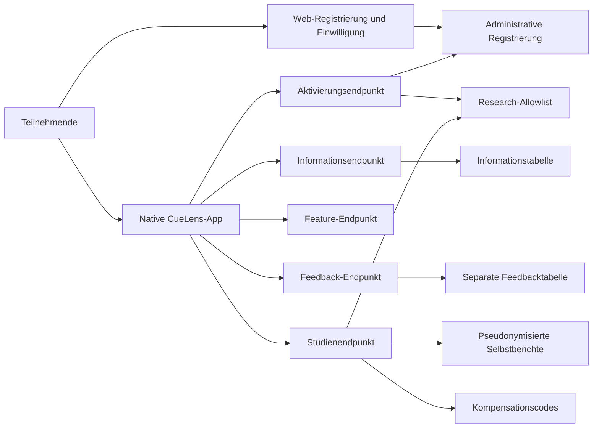
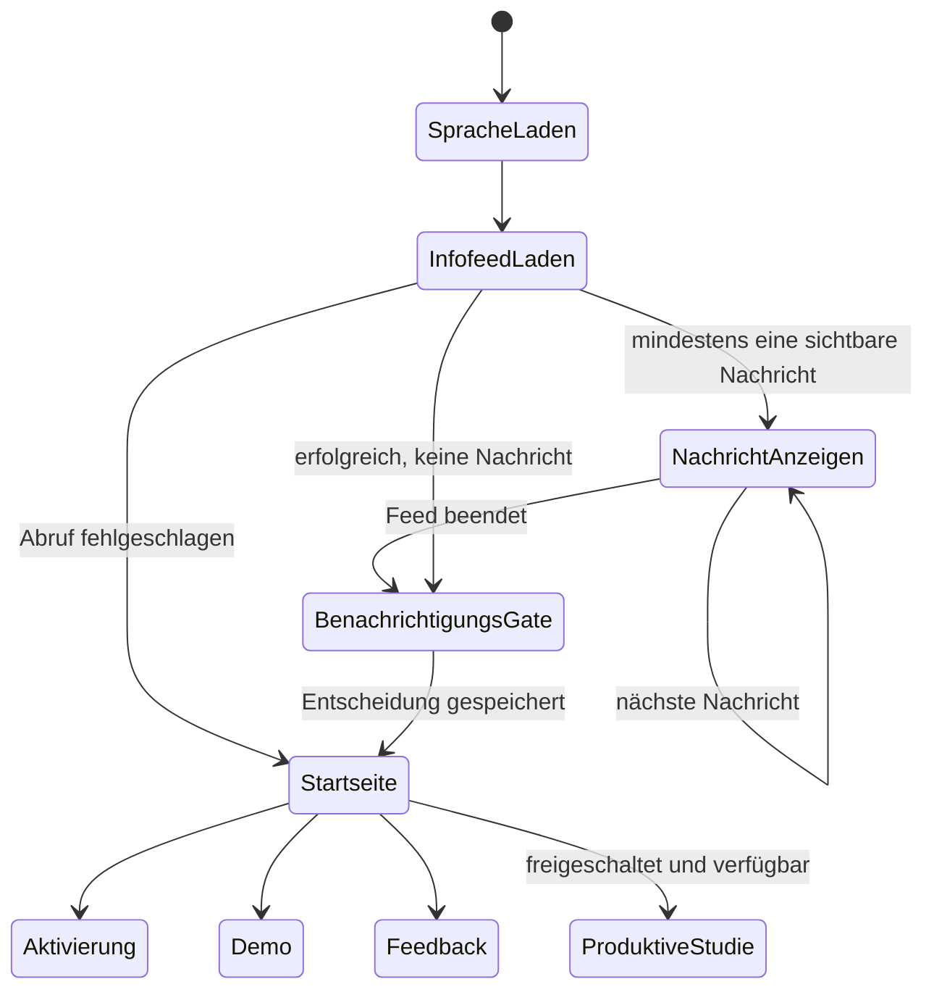
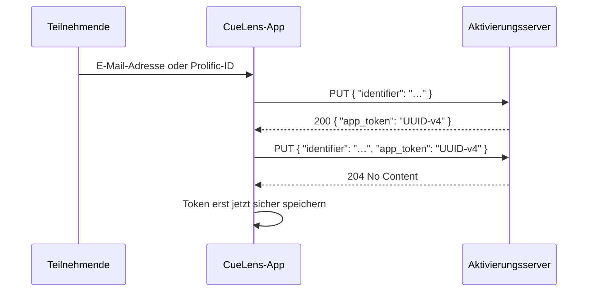
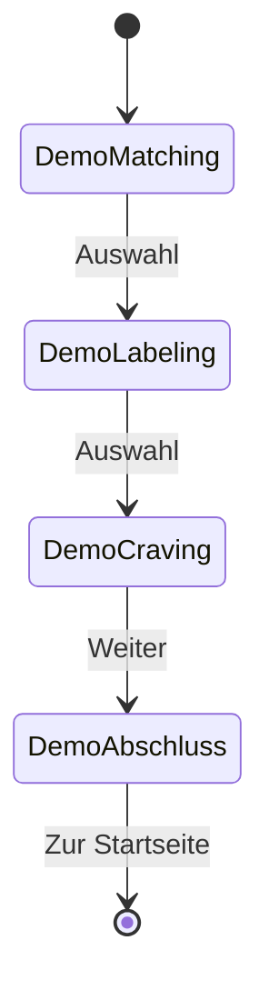
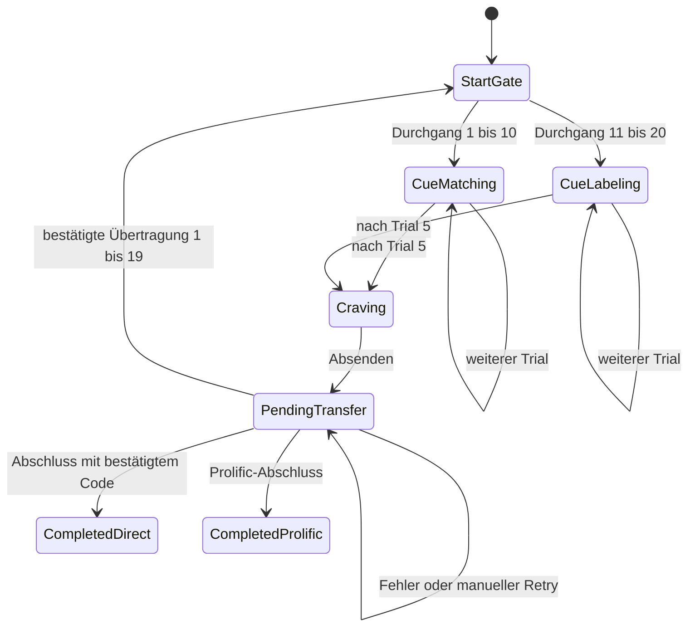

# CueLens – Plattformunabhängige Spezifikation der Studien-App

## Dokumentstatus

| Feld | Wert |
|---|---|
| Dokumenttyp | Plattformunabhängige funktionale und nichtfunktionale Spezifikation |
| Produkt | CueLens |
| Referenzimplementierung | Android-App mit `applicationId = de.eachandevery.cuelens` |
| Empfohlener Repository-Pfad | `cuelens-ios/PLATFORM_INDEPENDENT_SPECIFICATION.md` |
| Dokumentversion | 1.1 |
| Status | Verbindliche Ausgangsbasis für die native iOS-Portierung; Android-Referenz bleibt unverändert |
| Stand | 16. August 2026 |
| Abgeleitet aus | `main`, Commit `9ef5f38ee341a0f59a1b2844773c8cadc8a807c2` |
| Geltungsbereich | Aktuelle CueLens-Studien-App und bestehendes PHP-Hintergrundsystem |
| Nicht enthalten | KI-PoC unter `AI_PoC`, Kamera, eigene Bilder, On-Device-Klassifikation und spätere KI-Major-Version |

Diese Spezifikation formalisiert die fachlichen, studienmethodischen, datenschutzbezogenen, sicherheitstechnischen und stabilitätsbezogenen Eigenschaften der bereits praktisch eingesetzten Android-App. Sie beschreibt die gemeinsame Sollfunktion von Android und iOS, ohne eine bestimmte UI-Technologie, Programmiersprache oder Betriebssystem-API vorzuschreiben.

Für die Masterarbeit ist zu beachten, dass dieses Dokument teilweise eine **retrospektive Formalisierung der vorhandenen Implementierung** darstellt. Es ist daher als Entwicklungs- und Nachweisdokument zu verwenden, nicht als Behauptung, sämtliche Einzelanforderungen seien bereits vor Beginn der Android-Entwicklung vollständig festgelegt worden.

## 1. Normative Begriffe

Die Begriffe werden entsprechend der in der BSI TR-03161 verwendeten Systematik eingesetzt:

- **MUSS**: zwingend umzusetzen.
- **DARF NICHT**: unter keinen Umständen zulässig.
- **SOLL**: umzusetzen, sofern kein dokumentierter technischer oder methodischer Grund entgegensteht.
- **KANN**: optionale, mit dieser Spezifikation vereinbare Umsetzung.
- **Referenzverhalten**: in der aktuellen Android-App beobachtetes Verhalten, das für die iOS-Portierung beibehalten werden soll.
- **Gemeinsame Anforderung**: Anforderung an beide nativen Apps.
- **Zulässige Plattformabweichung**: ausdrücklich erlaubte Abweichung, die weder Studiendesign noch Datenschema oder Auswertung verändert.

## 2. Zweckbestimmung und Abgrenzung

### 2.1 Zweckbestimmung

CueLens ist ein Forschungsprototyp zur Durchführung einer mobilen Within-Subject-Studie über subjektives Rauchverlangen nach Cue-Matching und Cue-Labeling im Alltag.

Die App MUSS:

1. registrierten Teilnehmenden eine technische Aktivierung ermöglichen;
2. eine lokale Beispiel-Studiensituation anbieten;
3. nach serverseitiger Freischaltung 20 produktive Studiendurchgänge ermöglichen;
4. nach jedem produktiven Durchgang genau einen Selbstbericht zum aktuellen Rauchverlangen erfassen;
5. ausstehende Studienübertragungen zuverlässig erkennbar halten und erneut übertragbar machen;
6. den Studienabschluss abhängig vom Registrierungskanal darstellen;
7. allgemeine Informationen, Feedback und optionale neutrale Benachrichtigungen bereitstellen.

### 2.2 Medizinische Abgrenzung

Die App:

- ist **keine Therapie-App**;
- ersetzt keine Tabakentwöhnungsbehandlung;
- stellt keine Diagnose;
- gibt keine individuelle medizinische Empfehlung;
- verspricht keine Abstinenz oder Reduktion des Rauchverlangens;
- erhebt als primären Studienendpunkt ausschließlich subjektive Selbstberichte auf einer Skala von 0 bis 100.

### 2.3 Ausdrücklich nicht enthalten

Folgende Funktionen gehören nicht zu dieser Portierung und werden als spätere Major-Version behandelt:

- KI-gestützte Bildklassifikation;
- `AI_PoC`;
- LiteRT, TensorFlow Lite, Core ML oder ML Kit;
- Kamera- oder Fotomediathekzugriff;
- eigene Bilddateien der Teilnehmenden;
- Modell-Download oder dynamischer Austausch von Modellen;
- Benchmark-Modus und CSV-Export;
- dynamisches Nachladen oder Ausführen von App-Code.

Die aktuelle Portierung DARF daher keine Kamera-, Foto-, Mikrofon- oder Standortberechtigungen anfordern.

## 3. Verbindliche Projektentscheidungen für die Portierung

Die folgenden Entscheidungen sind Bestandteil dieser Spezifikation:

1. **Studiendesign unverändert:** iOS verwendet dieselben 20 Durchgänge, Bedingungen, Reize, Labels, Abstände und Selbstberichte wie Android.
2. **Auswertung unverändert:** Die iOS-App oder ihre spätere Einführung verändert die vorgesehene statistische Auswertung nicht.
3. **Keine Plattformvariable:** Die verwendete Plattform wird nicht als Studienvariable erhoben, gespeichert oder ausgewertet.
4. **Keine plattformübergreifend identische Randomisierung:** Android und iOS dürfen unterschiedliche native Zufallszahlengeneratoren und dadurch unterschiedliche konkrete Reiz- und Seitenfolgen verwenden.
5. **Keine erneute App-interne Zustimmung auf iOS:** Die erforderliche Zustimmung zur aktualisierten Datenschutzerklärung wird bei iOS-Teilnehmenden vor der App-Aktivierung im Webformular eingeholt und serverseitig dokumentiert.
6. **Bestehender Android-Zustimmungsfluss bleibt zulässig:** Die vorhandene Android-App darf ihren zusätzlichen App-internen Zustimmungsdialog unverändert behalten.
7. **Widerruf und Löschung ausschließlich per E-Mail:** Weder Android noch iOS erhalten eine App-interne Widerrufs- oder Löschfunktion. Anfragen erfolgen über `cuelens@each-and-every.de`.
8. **Bestehendes Backend-Protokoll bleibt erhalten:** Die iOS-App verwendet die vorhandenen Endpunkte und JSON-Verträge. Eine neue API-Version, zusätzliche Plattformfelder oder ein neues Übertragungsprotokoll sind nicht Bestandteil dieses Schritts.
9. **Android bleibt Referenz:** Die iOS-Portierung DARF keine Änderung der bestehenden Android-App voraussetzen.
10. **App-Version ohne Plattformkennzeichnung:** Übermittelte Versionsangaben SOLLEN keine Suffixe wie `android` oder `ios` enthalten.

## 4. Produktidentität und Zielumgebung

| Merkmal | Gemeinsame Anforderung |
|---|---|
| Produktname | `CueLens` |
| Android-Anwendungskennung | `de.eachandevery.cuelens` |
| Logische Produktidentität | identische CueLens-Studien-App auf Android und iOS |
| Gerätetyp | Smartphone oder Tablet |
| Ausrichtung | produktive Reizdarstellung ausschließlich in geeigneter hochformatiger Szenengeometrie; allgemeine iPad-Oberfläche adaptiv |
| Sprachen | Deutsch und Englisch |
| Netz | für Aktivierung, Informationen, Feedback, Feature-Konfiguration und Studiendaten erforderlich |
| Offline nutzbar | Startseite, bereits geladene lokale Zustände und Demo; produktive Übermittlung wird bei Fehler als ausstehend gehalten |
| Benachrichtigungen | optional; keine Teilnahmevoraussetzung |
| Tracking | nicht zulässig |
| Werbung | nicht zulässig |
| Cloud-Synchronisation von App-Daten | nicht zulässig |
| Produktive Transportverschlüsselung | ausschließlich HTTPS |

## 5. Systemkontext



### 5.1 Systemrollen

| Rolle | Verantwortung |
|---|---|
| Teilnehmende | Registrierung, Aktivierung, Durchführung der Aufgaben, Selbstbericht, optionales Feedback |
| Web-Registrierung | Einschlussprüfung, Studieninformation, Einwilligung und Registrierungskanal |
| Native App | lokale Interaktion, sichere Tokenhaltung, Studienablauf, Übertragung und Wiederherstellung |
| Administratives Backend | Registrierungsdaten, E-Mail beziehungsweise Prolific-ID, Einwilligungs- und Abschlussstatus |
| Forschungsbackend | Allowlist gehashter Tokens, pseudonymisierte Selbstberichte, Kompensationscodes |
| Studienverantwortliche | Support, Widerruf und Löschung per E-Mail sowie Abrechnung |

### 5.2 Technische Trennung

Administrative Registrierungsdaten, Feedback und wissenschaftliche Selbstberichte MÜSSEN logisch und tabellarisch getrennt bleiben.

Insbesondere gilt:

- E-Mail-Adresse und Prolific-ID DÜRFEN NICHT in `self_reports` gespeichert werden.
- Der App-Token DARF NICHT im Klartext in `self_reports` gespeichert werden.
- Feedback DARF NICHT automatisch mit App-Token, E-Mail-Adresse, Prolific-ID oder pseudonymer Studienkennung verknüpft werden.
- Die Plattform DARF NICHT in `self_reports`, Feedback oder Registrierung als Studienmerkmal ergänzt werden.

## 6. Studienmethodische Invarianten

| Parameter | Verbindlicher Wert |
|---|---:|
| Design | Within-Subject |
| Gesamtzahl produktiver Durchgänge | 20 |
| Cue-Matching-Durchgänge | 10 |
| Cue-Labeling-Durchgänge | 10 |
| Reihenfolge der Bedingungen | zuerst Cue-Matching, danach Cue-Labeling |
| Trials je Durchgang | 5 |
| Cue-Matching-Trials insgesamt | 50 |
| Cue-Labeling-Trials insgesamt | 50 |
| Selbstberichte insgesamt | 20 |
| Rauchverlangensskala | ganzzahlig 0 bis 100 |
| Standardwert der Skala | 50 |
| Mindestabstand zwischen bestätigten Durchgängen | 3 Stunden in Produktion |
| Wartezeit vor Auswahl beim produktiven Cue-Matching | 4 Sekunden |
| Wartezeit vor Auswahl beim Demo-Cue-Matching | 5 Sekunden |
| Wissenschaftlich gespeicherte Auswahlreaktionen | keine |
| Wissenschaftlich gespeicherter Endpunkt | Rauchverlangen je Durchgang |
| Plattformvariable | keine |

Die geplante Durchführung sieht bis zu drei Durchgänge pro Tag vor. Die aktuelle App erzwingt technisch jedoch nur den Mindestabstand von drei Stunden und keinen kalendertäglichen Höchstwert. Diese Eigenschaft wird für die Portierung beibehalten; die Begrenzung auf bis zu drei tägliche Nutzungen bleibt eine organisatorische Studienanweisung.

Die Einführung von iOS:

- erzeugt keine zusätzliche Studienbedingung;
- verändert nicht die Bedingungsreihenfolge;
- verändert nicht die Skala;
- verändert nicht die Datenstruktur der Selbstberichte;
- führt zu keiner Plattformstratifizierung oder Plattform-Kovariate;
- verändert nicht die vorgesehene gemeinsame Auswertung der Selbstberichte.

## 7. Dateninventar und Datensparsamkeit

| Datenelement | Entstehung | Lokale Speicherung | Übertragung | Serverseitige Speicherung | Schutz |
|---|---|---|---|---|---|
| E-Mail-Adresse oder Prolific-ID | Aktivierungseingabe | nur flüchtig bis Abschluss/Fehler | Aktivierungsendpunkt | administrative Registrierung | nicht in Forschungsdaten |
| App-Token, UUID-v4 | Aktivierungsantwort | dauerhaft im sicheren OS-Credential-Store | Aktivierungsbestätigung, Datenschutzstatus auf Android, Selbstbericht | nur abgeleitete Hashwerte | gerätegebunden, nicht synchronisiert |
| Ausgewählte Sprache | App-Nutzung | dauerhaft | nein | nein | lokale Einstellung |
| Ausgeblendete Nachrichten-IDs | Informationsfeed | dauerhaft | nein | nein | nur positive numerische IDs |
| Bekannte Nachrichten-IDs | Benachrichtigungsprüfung | dauerhaft | nein | nein | nur positive numerische IDs |
| Benachrichtigungseinwilligung | App-Nutzung | dauerhaft | nein | nein | lokale Einstellung |
| Cue-Matching-Reihenfolge | erste produktive Nutzung | dauerhaft | nein | nein | vollständige Permutation der Cue-Indizes |
| Bestätigte Durchgänge | Serverantwort | dauerhaft | nein | serverseitig aus Berichten ableitbar | kritischer Fortschrittszustand |
| Nächster Freischaltzeitpunkt | bestätigte Übertragung | dauerhaft | nein | nein | lokaler Zeitstempel |
| Ausstehender Craving-Wert | produktiver Selbstbericht | bis bestätigte Übertragung | Studienendpunkt | `self_reports.craving` | sensibler lokaler Zustand |
| Bedingungscode | serverseitig aus Index | nein | wird nicht vom Client angefordert | `CUE_MATCHING` oder `CUE_LABELING` | nicht clientseitig bestimmbar |
| Pseudonyme Teilnehmendenkennung | aus App-Token | nein | nein | HMAC-SHA-256-Ableitung | keine direkte Personenkennung |
| Kompensationscode | Abschlussantwort | bis/ab bestätigtem Abschluss | Bestätigung an Studienendpunkt | separate Tabelle | lokal geschützt |
| Demo-Auswahl und Demo-Craving | Demo | nur im Arbeitsspeicher | nein | nein | nach Verlassen verworfen |
| Matching-/Labeling-Auswahl | produktiver Trial | nicht dauerhaft | nein | nein | keine wissenschaftliche Speicherung |
| Feedbackquelle/-kommentar | Feedbackformular | nur bis Sendeabschluss | Feedback-Endpunkt | separate Feedbacktabelle | keine automatische Identifikation |
| App-Version | Feedback und Selbstbericht | aus Build | als `app_version` | bei Feedback; nicht als Studienplattform | ohne Plattform-Suffix |
| Plattform, OS, Gerätemodell, Geräte-ID | — | DARF NICHT erhoben werden | DARF NICHT als fachliches Feld gesendet werden | DARF NICHT als Studienvariable gespeichert werden | verboten |

Unvermeidbare technische Transportmetadaten des Hosting- oder Betriebssystems, beispielsweise IP-Adresse oder Standard-HTTP-Metadaten, sind keine Forschungsvariablen. Sie DÜRFEN NICHT in die Forschungsdaten übernommen oder für die Studienauswertung verwendet werden.

## 8. Globaler App-Zustand und Navigation

### 8.1 Initialisierung

Beim App-Start MUSS folgende Reihenfolge gelten:

1. lokale Sprache und Einstellungen lesen;
2. Informationsfeed laden, sofern eine Netzwerkverbindung verfügbar ist;
3. nicht dauerhaft ausgeblendete Nachrichten anzeigen;
4. nach erfolgreichem Feed-Abruf gegebenenfalls den einmaligen App-internen Benachrichtigungsdialog anzeigen;
5. die Startseite anzeigen;
6. auf der Startseite Studienfortschritt, Feature-Status und ausstehende Übertragungen aktualisieren.

Ein Fehler beim Informationsfeed DARF den App-Start nicht blockieren.



### 8.2 Sprache

- Die App MUSS Deutsch und Englisch unterstützen.
- Beim ersten Start gilt Englisch nur dann als Standardsprache, wenn die primäre Systemsprache Englisch ist; ansonsten gilt Deutsch.
- Die Auswahl MUSS lokal gespeichert werden.
- Ein Sprachumschalter MUSS auf allen regulären App-Seiten einschließlich produktiver Studie sichtbar und bedienbar sein.
- Der Sprachwechsel MUSS die sichtbaren Texte ohne App-Neustart aktualisieren.
- Die fachliche Bedeutung der Texte MUSS zwischen Android und iOS gleich bleiben.
- Die bestehenden Android-Stringressourcen sind die sprachliche Referenz für Version 1 der Portierung.

### 8.3 Startseite

Die Startseite MUSS abhängig vom Zustand folgende Elemente anbieten:

| Zustand | Aktivierung | Demo | Feedback | Nächster Durchgang | Abschluss |
|---|---:|---:|---:|---:|---:|
| nicht aktiviert | sichtbar und aktiv | sichtbar | sichtbar | nicht sichtbar | nicht sichtbar |
| aktiviert, Feature deaktiviert | als abgeschlossen angezeigt/disabled | sichtbar | sichtbar | nicht sichtbar | nicht sichtbar |
| aktiviert, Feature aktiv, Wartezeit läuft | disabled/abgeschlossen | sichtbar | sichtbar | sichtbar mit Countdown | nicht sichtbar |
| ausstehende Übertragung | disabled/abgeschlossen | sichtbar | sichtbar | nicht startbar; Retry sichtbar | nicht sichtbar |
| Studie abgeschlossen | nicht sichtbar | nicht sichtbar | sichtbar | nicht sichtbar | sichtbar |
| sicherer Tokenzugriff fehlgeschlagen | disabled und Fehlermeldung | sichtbar, sofern nicht abgeschlossen | sichtbar | nicht sichtbar | abhängig vom gespeicherten Zustand |

## 9. Informationsfeed

### 9.1 Abruf

Die App MUSS Informationen über den konfigurierten Nachrichtenendpunkt per `GET` abrufen.

Eine gültige Antwort besitzt die Form:

```json
{
  "messages": [
    {
      "id": 1,
      "created_at": "2026-07-07T20:00:00Z",
      "text_de": "Deutscher Nachrichtentext",
      "text_en": "English message text"
    }
  ]
}
```

Die App MUSS die gesamte Antwort ablehnen, wenn:

- `messages` fehlt oder kein Array ist;
- eine ID nicht ganzzahlig, nicht positiv oder innerhalb der Antwort doppelt ist;
- `created_at` nicht dem Format `YYYY-MM-DDTHH:MM:SSZ` entspricht;
- einer der beiden Sprachtexte fehlt oder nicht als String interpretierbar ist.

Nachrichten werden nach `created_at` aufsteigend und bei Gleichstand nach `id` aufsteigend angezeigt.

### 9.2 Anzeige und Ausblendung

Jede sichtbare Nachricht MUSS als eigene Vollbildseite angezeigt werden mit:

- Nachrichtentext in der gewählten Sprache;
- Checkbox „Diese Nachricht nicht mehr anzeigen“ beziehungsweise englischer Entsprechung;
- Schaltfläche „OK“.

Verhalten:

1. Ohne gesetzte Checkbox wird die Nachricht nur für die aktuelle Feed-Sitzung geschlossen und kann bei einem späteren App-Start erneut erscheinen.
2. Mit gesetzter Checkbox MUSS die positive Nachrichten-ID lokal dauerhaft gespeichert werden.
3. Gespeichert werden nur IDs, keine Nachrichtentexte.
4. Scheitert das Speichern der Ausblendung, wird trotzdem zur nächsten Seite gewechselt und eine neutrale Fehlermeldung angezeigt.
5. Zurücknavigation innerhalb des Feeds zeigt die vorherige Nachricht; auf der ersten Nachricht beendet sie den Feed.
6. Das Beenden des Feeds markiert die abgerufenen IDs für die Benachrichtigungslogik als bekannt, nicht jedoch als dauerhaft ausgeblendet.

### 9.3 Fehlerverhalten

Bei Netzwerk-, HTTP- oder Protokollfehler:

- wird eine kurze neutrale Fehlermeldung angezeigt;
- wird die Startseite weiterhin geöffnet;
- werden keine fehlerhaften oder unvollständigen Nachrichten gespeichert;
- wird die produktive Studie nicht allein wegen des Feed-Fehlers blockiert.

## 10. Benachrichtigungen

### 10.1 Gemeinsame Einwilligung

Es gibt eine gemeinsame optionale Benachrichtigungseinstellung für:

- neue allgemeine CueLens-Informationen;
- die Verfügbarkeit eines neuen Studiendurchgangs.

Die App MUSS vor einer Systemberechtigungsanfrage einen eigenen verständlichen Dialog anzeigen. Die vorausgewählte Option ist aktiviert.

- Bei Deaktivierung wird keine Systemberechtigung angefragt.
- Bei Ablehnung oder Deaktivierung bleiben sämtliche Kernfunktionen nutzbar.
- Die Entscheidung wird lokal gespeichert.
- Bei deaktivierten Benachrichtigungen werden geplante Hintergrundprüfungen und Studienerinnerungen beendet.
- Die App MUSS vor jeder Benachrichtigung zusätzlich prüfen, ob die systemseitige Berechtigung aktuell besteht.

### 10.2 Benachrichtigung über neue Informationen

Wenn Benachrichtigungen aktiviert sind, SOLL die App plattformgerecht und bestmöglich etwa täglich nach neuen Nachrichten suchen. Exakte Ausführungszeiten sind nicht studienkritisch und dürfen durch das Betriebssystem verzögert werden.

Eine Nachricht gilt als neu, wenn ihre ID:

- noch nicht als bekannt gespeichert ist und
- nicht dauerhaft ausgeblendet wurde.

Nach erfolgreichem Abruf werden alle abgerufenen IDs als bekannt gespeichert. Pro Prüfung wird höchstens eine generische Benachrichtigung erzeugt.

Erforderliche Semantik:

- Titel: `CueLens`
- Deutsch: `Neue Information zu CueLens verfügbar`
- Englisch: `New CueLens information available`

Beim Öffnen MUSS die App den Informationsfeed erneut abrufen.

### 10.3 Erinnerung an einen neuen Studiendurchgang

Eine Erinnerung DARF nur geplant beziehungsweise angezeigt werden, wenn:

- Benachrichtigungen aktiviert und systemseitig erlaubt sind;
- die App aktiviert ist;
- die Studie nicht abgeschlossen ist;
- keine Übertragung aussteht;
- mindestens ein Durchgang bestätigt wurde;
- der erwartete nächste Durchgang zwischen 2 und 20 liegt;
- ein gültiger Freischaltzeitpunkt vorliegt;
- für dieselbe Durchgangsnummer noch keine Erinnerung angezeigt wurde;
- die serverseitige Studienfunktion aktiviert ist.

Erforderliche Semantik:

- Titel: `CueLens`
- privater Text Deutsch: `Eine neue Aufgabe ist verfügbar.`
- privater Text Englisch: `A new task is available.`
- öffentlicher Sperrbildschirmtext Deutsch: `Eine neue Information ist verfügbar.`
- öffentlicher Sperrbildschirmtext Englisch: `New information is available.`

Benachrichtigungen DÜRFEN NICHT enthalten:

- Rauchstatus;
- Rauchverlangenswert;
- E-Mail-Adresse;
- Prolific-ID;
- App-Token;
- Bedingungsname;
- Studienfortschritt.

Beim Öffnen der Erinnerung MUSS die App zur Startseite wechseln und den aktuellen Studienstatus erneut prüfen.

## 11. Aktivierung

### 11.1 Zulässige Kennungen

Das Aktivierungsfeld akzeptiert genau eine der folgenden Kennungen:

- syntaktisch gültige E-Mail-Adresse;
- Prolific-ID mit genau 24 alphanumerischen ASCII-Zeichen.

Die Eingabe wird getrimmt. E-Mail-Adressen werden serverseitig für den Abgleich kleingeschrieben; Prolific-IDs bleiben in ihrer Zeichenfolge erhalten.

Die Eingabe DARF nach erfolgreicher Aktivierung nicht dauerhaft in der App gespeichert werden.

### 11.2 Zweistufiger Client-Handshake



Anforderungen:

1. Die App MUSS während beider Requests weitere Aktivierungsversuche sperren.
2. Der erste Request erwartet HTTP 200 und genau einen syntaktisch gültigen UUID-v4-App-Token.
3. Der zweite Request erwartet HTTP 204.
4. Der Token DARF erst nach erfolgreicher Bestätigung sicher gespeichert werden.
5. Die Aktivierung ist auf Serverseite fünf Minuten gültig.
6. Bereits aktivierte Apps DÜRFEN keine erneute Aktivierung anbieten.
7. Ein Fehler des sicheren Credential-Stores MUSS fail-closed behandelt werden; produktive Nutzung und erneute Aktivierung bleiben gesperrt.
8. Normale Fehler erzeugen eine neutrale Meldung „Bitte versuchen Sie es später noch einmal“.
9. Ein Timeout während der zweiten Bestätigung erzeugt einen Supporthinweis, weil der serverseitige Erfolg unklar sein kann.
10. Der Supportkontakt lautet `cuelens@each-and-every.de`.

### 11.3 Serverseitige Voraussetzungen

Ein Token darf nur ausgegeben werden, wenn die administrative Registrierung:

- vorhanden ist;
- bestätigt wurde;
- dem richtigen Registrierungskanal entspricht;
- die Studieninformation beziehungsweise Einwilligung dokumentiert;
- noch keinen dauerhaft ausgegebenen App-Token besitzt.

Nach Bestätigung werden:

- der administrative Datensatz als aktiviert markiert;
- ein domänenseparierter Hash für die Forschungs-Allowlist gespeichert;
- ein gesonderter domänenseparierter Hash zur administrativen Wiederzuordnung gespeichert;
- je nach Registrierungskanal der Abschlussmodus festgelegt.

## 12. Datenschutz-Zustimmung, Widerruf und Löschung

### 12.1 Gemeinsame Voraussetzung

Vor Aktivierung eines iOS-Teilnehmenden MUSS die erforderliche Zustimmung zur aktuellen Studieninformation und Datenschutzerklärung im Webformular eingeholt und administrativ dokumentiert worden sein.

Die iOS-App:

- benötigt keinen erneuten App-internen Zustimmungsdialog;
- benötigt für diese Portierung keinen Aufruf des bestehenden Android-Endpunkts `dataprot.php`;
- darf einen rein informativen Link zur Datenschutzerklärung anbieten, sofern dies keine neue Pflichtstrecke erzeugt.

Die bestehende Android-App darf ihren zusätzlichen App-internen Zustimmungsstatus und `dataprot.php` unverändert weiterverwenden. Diese Abweichung ist beabsichtigt und verändert weder die Studiendaten noch die Auswertung.

### 12.2 Widerruf und Löschung

- Es gibt keine App-interne Widerrufsfunktion.
- Es gibt keine App-interne serverseitige Löschfunktion.
- Es gibt keine App-interne Abmeldung oder Tokenfreigabe für eine andere Person.
- Widerrufs-, Auskunfts- und Löschanfragen erfolgen ausschließlich per E-Mail an `cuelens@each-and-every.de`.
- Nutzertexte zur Wahrnehmung dieser Rechte MÜSSEN auf den E-Mail-Kanal verweisen.
- Eine Deinstallation entfernt den regulären lokalen App-Container. Überlebt ein sicherer Credential-Eintrag technisch eine Neuinstallation, MUSS die Plattformimplementierung verwaiste Tokens erkennen und deren unkontrollierte Wiederverwendung verhindern.

## 13. Beispiel-Studiensituation

Die Demo ist ohne Aktivierung verfügbar, solange die Studie lokal nicht abgeschlossen ist.

Ablauf:



### 13.1 Demo-Cue-Matching

- Cue: `cue_000`
- Optionen: `match_a_000` und `match_b_000`
- Seitenreihenfolge: zufällig
- Wartezeit: 5 Sekunden
- Optionen sind während des Countdowns sichtbar, aber nicht auswählbar.
- Nach Ablauf erscheint die Aufforderung zur Auswahl.
- Die konkrete Auswahl wird nicht gespeichert.

### 13.2 Demo-Cue-Labeling

- Cue: `cue_001`
- deutsche Labels: `Aschegeruch` und `Regenschirmmoment`
- englische Labels: `Ash smell` und `Umbrella moment`
- Reihenfolge: zufällig
- Auswahl sofort möglich
- Auswahl wird nicht gespeichert.

### 13.3 Demo-Rauchverlangen

- ganzzahliger Slider von 0 bis 100;
- Standardwert 50;
- aktueller Zahlenwert sichtbar;
- Wert bleibt nur im Arbeitsspeicher;
- keine Übertragung;
- kein Studienfortschritt;
- keine Sperrzeit;
- kein Kompensationscode.

### 13.4 Demo-Abschluss

Die Abschlussseite MUSS ausdrücklich mitteilen, dass keine Daten übertragen oder dauerhaft gespeichert wurden.

Zurücknavigation aus jedem Demoschritt beendet die Demo und kehrt zur Startseite zurück. Ein späterer Demoaufruf beginnt erneut beim ersten Schritt.

## 14. Feedback

### 14.1 Verfügbarkeit

Feedback ist:

- ohne Aktivierung verfügbar;
- auch nach Studienabschluss verfügbar;
- technisch und tabellarisch von wissenschaftlichen Selbstberichten getrennt.

### 14.2 Felder und Validierung

| Feld | Typ | Maximum | Pflicht |
|---|---|---:|---|
| `source` | einzeiliger Freitext | 500 Unicode-Zeichen | mindestens eines der beiden Freitextfelder |
| `comment` | mehrzeiliger Freitext | 5.000 Unicode-Zeichen | mindestens eines der beiden Freitextfelder |
| `app_version` | Build-Version | 64 Zeichen serverseitig | optional im Protokoll, von der App zu senden |

Die App MUSS darauf hinweisen, keine personenbezogenen Daten, E-Mail-Adressen oder Abrechnungscodes einzugeben.

Die App DARF NICHT automatisch beifügen:

- App-Token;
- E-Mail-Adresse;
- Prolific-ID;
- Plattform;
- Gerätekennung;
- Rauchverlangenswerte.

### 14.3 Übertragung und Ergebnis

- Methode: `POST`
- Content-Type: JSON UTF-8
- Erfolg: jeder HTTP-2xx-Status; der aktuelle Server antwortet mit 204.
- Bei Erfolg wird eine Dankesmeldung angezeigt.
- Bei Fehler bleibt das Formular für einen manuellen erneuten Versuch geöffnet.
- Es gibt keine persistente lokale Feedback-Warteschlange.
- Der Server besitzt ein Soft-Limit von 200 gespeicherten Einträgen.
- Nach Erreichen des Limits wird ein formal gültiger Request still verworfen und weiterhin mit 204 beantwortet.

## 15. Serverseitige Feature-Konfiguration

Die produktive Studie wird über das globale Feature `next_study_run_enabled` freigeschaltet.

Gültige Antwort:

```json
{
  "features": {
    "next_study_run_enabled": true
  }
}
```

Anforderungen:

- Methode: `GET`.
- Nur ein expliziter boolescher Wert `true` aktiviert die Funktion.
- Netzwerk-, HTTP-, JSON- oder Schemafehler werden als `false` behandelt.
- Bei `false` wird kein Startknopf für einen produktiven Durchgang angeboten.
- Das Studien-Backend prüft das Feature zusätzlich und kann Requests bei deaktivierter Funktion ablehnen.
- Die Feature-Konfiguration ist keine Teilnehmendenzuordnung und enthält keine Plattforminformation.

## 16. Produktive Studie

### 16.1 Zugangsvoraussetzungen

Ein produktiver Durchgang DARF nur beginnen, wenn:

1. ein sicher gespeicherter App-Token vorhanden ist;
2. die globale Studienfunktion aktiv ist;
3. die Studie nicht abgeschlossen ist;
4. weniger als 20 Durchgänge bestätigt wurden;
5. keine Selbstberichtübertragung oder Abschlussbestätigung aussteht;
6. kein lokaler ungültiger Abschlusszustand vorliegt;
7. der Mindestabstand abgelaufen ist;
8. die erforderlichen Reizressourcen vollständig vorhanden sind;
9. auf Android gegebenenfalls der bestehende zusätzliche Datenschutzstatus erfüllt ist;
10. auf iOS die externe Web-Einwilligung als Registrierungsprämisse erfüllt wurde.

### 16.2 Zustandsautomat eines Durchgangs



### 16.3 Reizressourcen

Die aktuelle Studienversion verwendet:

- `cue_000` bis `cue_049`;
- `match_a_000` bis `match_a_049`;
- `match_b_000` bis `match_b_049`;
- die 50 Labelzuordnungen aus Anhang A.

Für Cue-Matching ist ein Item nur vollständig, wenn Cue, Option A und Option B vorhanden sind. Die Apps MÜSSEN vor Freigabe eines Durchgangs prüfen, dass genügend vollständige Items verfügbar sind.

Die iOS-App MUSS dieselben Bildinhalte wie Android verwenden. Betriebssystembedingte Dateinamen oder Asset-Container dürfen abweichen, der visuelle Reizinhalt jedoch nicht.

### 16.4 Cue-Matching, Durchgänge 1 bis 10

- Insgesamt werden 50 vollständige Cue-Matching-Items verwendet.
- Beim ersten produktiven Matching-Zugriff wird eine zufällige Permutation aller verfügbaren Item-Indizes erzeugt und lokal gespeichert.
- Die Permutation MUSS vollständig sein und jeden Index genau einmal enthalten.
- Jeder Durchgang verwendet die nächsten fünf Einträge dieser Permutation.
- Über alle zehn Matching-Durchgänge wird jeder Cue genau einmal gezeigt.
- Die beiden zugehörigen Match-Bilder werden bei jeder Darbietung zufällig links/rechts beziehungsweise in erster/zweiter Position angeordnet.
- Cue und Optionen sind sofort sichtbar.
- Die Optionen sind für 4 Sekunden deaktiviert.
- Ein sichtbarer Countdown zeigt die verbleibenden Sekunden.
- Nach Ablauf des Countdowns werden die Optionen aktiv.
- Jeder Tap auf eine aktive Option führt zum nächsten Trial.
- Die gewählte Option wird weder gespeichert noch übertragen.

Die konkrete Zufallsfolge MUSS zwischen Android und iOS nicht identisch sein.

### 16.5 Cue-Labeling, Durchgänge 11 bis 20

- Verwendet werden `cue_000` bis `cue_049` in fünf aufeinanderfolgenden Cue-Blöcken pro Durchgang.
- Zu jedem Cue werden genau zwei sprachabhängige Labels aus Anhang A angeboten.
- Die beiden Labels werden bei jeder Darbietung zufällig in ihrer Position angeordnet.
- Es gibt keine viersekündige Sperrzeit.
- Die Auswahl ist sofort möglich.
- Jeder Tap führt zum nächsten Trial.
- Die gewählte Bezeichnung wird weder gespeichert noch übertragen.
- Die konkrete Seitenfolge MUSS zwischen Android und iOS nicht identisch sein.

### 16.6 Visuelle Darbietung

Für produktive Cue-Darbietungen gelten folgende interventionsrelevante Anforderungen:

- hochformatige Darstellung, die auf dem iPhone den Vollbildbereich und auf dem iPad die gesamte geeignete Szenenfläche nutzt;
- Cue-Bild füllt die sichtbare Fläche mit zentriertem Crop-Verhalten;
- kein Letterboxing um das Cue-Bild;
- Match-Bilder beziehungsweise Labelschaltflächen liegen als Overlay im unteren Bildschirmbereich;
- Match-Bilder behalten ihr Seitenverhältnis und bleiben vollständig sichtbar;
- Sprachumschalter bleibt oben rechts erreichbar;
- es werden keine zusätzlichen therapeutischen Hinweise oder Wirksamkeitsversprechen eingeblendet.

Native Abstände, Schriftmetriken und Bedienelemente dürfen plattformgerecht variieren, sofern Reizgröße, Reihenfolge, Wartezeit und Auswahlprinzip erhalten bleiben.

### 16.7 Rauchverlangensabfrage

Nach dem fünften Trial MUSS die Frage erscheinen:

- Deutsch: `Wie hoch ist in diesem Moment Ihr Rauchverlangen?`
- Englisch: `How strong is your craving to smoke at this moment?`

Erfassung:

- Wertebereich 0 bis 100;
- ganzzahlige Schritte;
- Standardwert 50;
- Schaltfläche `Absenden` beziehungsweise `Submit`;
- der Wert wird erst durch aktives Absenden übernommen.

Die App MUSS den Wert vor dem ersten Netzwerkversuch dauerhaft als ausstehend speichern.

### 16.8 Mindestabstand

Nach einer bestätigten nicht-finalen Übertragung:

- wird der bestätigte Durchgangszähler um eins erhöht;
- wird der ausstehende Craving-Wert gelöscht;
- wird der nächste Freischaltzeitpunkt auf aktuelle Gerätezeit plus konfigurierten Cooldown gesetzt.

Konfiguration:

- Produktion: 10.800.000 ms = 3 Stunden;
- Staging/Debug: KANN auf wenige Sekunden verkürzt sein.

Während des Cooldowns zeigt die Startseite einen Countdown im Format `HH:MM:SS`. Ein neuer Durchgang DARF erst bei `00:00:00` gestartet werden.

### 16.9 Unterbrechung

Die Portierung behält das Referenzverhalten bei:

- Bestätigter Fortschritt und ausstehender Craving-Wert MÜSSEN dauerhaft erhalten bleiben.
- Einzelne Trialauswahlen müssen nicht dauerhaft gespeichert werden.
- Ein nicht abgesendeter oder nicht bestätigter Durchgang wird nicht gezählt.
- Nach Prozessabbruch oder App-Neustart darf derselbe unbestätigte Durchgang ab dem ersten Trial erneut beginnen.
- Die gespeicherte Cue-Matching-Permutation bleibt dabei erhalten; die konkrete Seitenanordnung darf neu randomisiert werden.
- Es gibt keine Funktion zum Überspringen eines Trials oder zum manuellen Hochsetzen des Fortschritts.

## 17. Übertragung, Wiederherstellung und Studienabschluss

### 17.1 Persistenter Pending-Zustand

Vor der Übertragung wird der Craving-Wert als `pending` gespeichert.

Solange ein Pending-Zustand besteht:

- darf kein neuer Durchgang starten;
- zeigt die Startseite eine ausstehende Übertragung;
- muss ein manueller Retry möglich sein;
- darf der Wert nicht durch eine neue Eingabe überschrieben werden.

Unmittelbar nach dem Absenden versucht die App die Übertragung. Scheitert sie, bleibt der Pending-Zustand erhalten.

### 17.2 Selbstbericht

Request:

```json
{
  "app_token": "550e8400-e29b-41d4-a716-446655440000",
  "craving": 63,
  "app_version": "1.0"
}
```

Die App sendet insbesondere **nicht**:

- Bedingungscode;
- Situationindex;
- ausgewählte Match- oder Labeloption;
- Sprache;
- Plattform;
- OS-Version;
- Gerätemodell;
- Zeitstempel;
- E-Mail-Adresse;
- Prolific-ID.

### 17.3 Laufende Antwort, Durchgänge 1 bis 19

```json
{
  "success": true,
  "situation_index": 7,
  "condition_code": "CUE_MATCHING"
}
```

Validierung:

- `success` muss exakt `true` sein;
- `situation_index` muss ganzzahlig sein;
- der Index muss dem lokal erwarteten nächsten Durchgang entsprechen;
- Index 1 bis 10 erfordert `CUE_MATCHING`;
- Index 11 bis 19 erfordert `CUE_LABELING`;
- unerwartete Abschlussfelder führen zu einem Protokollfehler.

Erst nach erfolgreicher Validierung wird der lokale Fortschritt erhöht und der Pending-Wert gelöscht.

### 17.4 Direkter Abschluss mit Kompensationscode

Finale Antwort:

```json
{
  "success": true,
  "status": "complete",
  "situation_index": 20,
  "condition_code": "CUE_LABELING",
  "compensation_code": "123e4567-e89b-42d3-a456-426614174000"
}
```

Verhalten:

1. Index muss 20 sein.
2. Bedingung muss `CUE_LABELING` sein.
3. Der Code muss UUID-v4 sein.
4. Der Code wird zunächst als „Bestätigung ausstehend“ dauerhaft gespeichert.
5. Die App sendet anschließend an denselben Endpunkt:

```json
{
  "compensation_code": "123e4567-e89b-42d3-a456-426614174000"
}
```

6. Erwartet wird HTTP 204.
7. Erst danach wird der Abschluss lokal als bestätigt markiert.
8. Bei Fehler bleibt der Code erhalten und kann erneut bestätigt werden.
9. Nach bestätigtem Abschluss wird der Code angezeigt und kann auf ausdrückliche Aktion kopiert werden.
10. Der UI-Text fordert zur Übermittlung an `cuelens@each-and-every.de` auf.

### 17.5 Prolific-Abschluss

Finale Antwort:

```json
{
  "success": true,
  "status": "complete",
  "situation_index": 20,
  "condition_code": "CUE_LABELING",
  "completion_mode": "PROLIFIC_MANUAL"
}
```

Anforderungen:

- `compensation_code` darf nicht vorhanden sein;
- der lokale Zustand wird unmittelbar als Prolific-Abschluss markiert;
- es wird kein Kompensationscode angezeigt;
- die App weist darauf hin, dass der Abschluss bei Prolific üblicherweise innerhalb von zwei Tagen erfolgt.

### 17.6 Ungültiger lokaler Zustand

Ein lokaler Zustand ist insbesondere ungültig, wenn:

- „abgeschlossen“ gesetzt ist, aber Abschlussmodus oder Code fehlen;
- ein Code leer oder formal ungültig ist;
- Prolific-Abschluss und Kompensationscode gleichzeitig vorliegen;
- ein ausstehender Craving-Wert gleichzeitig mit einem abgeschlossenen Zustand vorliegt;
- ein unbekannter Abschlussmodus gespeichert ist.

Ein ungültiger Zustand MUSS fail-closed behandelt werden. Es darf kein weiterer Durchgang beginnen; die App zeigt eine neutrale Übertragungs- beziehungsweise Supportlage und legt keine neuen wissenschaftlichen Daten an.

## 18. Lokales Zustandsmodell

Eine Plattformimplementierung MUSS logisch mindestens folgende Zustände abbilden:

```text
AppSettings
- selectedLanguage: DE | EN
- notificationPromptCompleted: Boolean
- notificationsEnabled: Boolean
- dismissedMessageIds: Set<PositiveInteger>
- knownMessageIds: Set<PositiveInteger>

SecureIdentity
- appToken: UUIDv4 | null

StudyProgress
- confirmedSituationCount: Integer 0..20
- nextSituationAvailableAt: Timestamp | null
- lastNotifiedSituationNumber: Integer 0..20
- matchingOrder: permutation<Integer> | empty
- pendingCraving: Integer 0..100 | null
- completionMode: null | COMPENSATION_CODE | PROLIFIC_MANUAL
- compensationCode: UUIDv4 | null
- studyCompleted: Boolean
```

Invarianten:

1. `confirmedSituationCount` liegt zwischen 0 und 20.
2. `pendingCraving` liegt entweder nicht vor oder zwischen 0 und 100.
3. Eine Matching-Permutation enthält bei vollständigem Reizsatz alle Indizes genau einmal.
4. `studyCompleted = true` erfordert einen gültigen Abschlusszustand.
5. `PROLIFIC_MANUAL` darf keinen Kompensationscode besitzen.
6. `COMPENSATION_CODE` erfordert einen gültigen UUID-v4-Code.
7. Ein ausstehender Code gilt noch nicht als abgeschlossener direkter Abschluss.
8. Kritische Fortschrittsänderungen MÜSSEN synchron beziehungsweise atomar dauerhaft geschrieben werden, bevor der UI-Zustand als bestätigt gilt.
9. Der sichere Token und der reguläre Studienzustand MÜSSEN derselben Installation logisch zugeordnet bleiben.

## 19. HTTP-API-Verträge

### 19.1 Endpunktübersicht

| Funktion | Produktion | Methode | Erfolg |
|---|---|---|---|
| Aktivierung | `https://cuelens.each-and-every.de/activate.php` | `PUT` | 200 beziehungsweise 204 |
| Informationsfeed | `https://cuelens.each-and-every.de/messages.php` | `GET` | 200 |
| Feedback | `https://cuelens.each-and-every.de/feedback.php` | `POST` | 204 |
| Feature-Konfiguration | `https://cuelens.each-and-every.de/features.php` | `GET` | 200 |
| Selbstbericht und Codebestätigung | `https://cuelens.each-and-every.de/submit.php` | `PUT` | 200 beziehungsweise 204 |
| Android-Zusatzstatus Datenschutz | `https://cuelens.each-and-every.de/dataprot.php` | `POST`/`PUT` | 200; nicht für iOS erforderlich |

### 19.2 Allgemeine Anforderungen

- JSON wird als UTF-8 übertragen.
- Schreibende Requests verwenden `Content-Type: application/json; charset=UTF-8`.
- Produktionsendpunkte verwenden ausschließlich HTTPS.
- Requests besitzen endliche Verbindungs- und Lesezeitlimits; Referenzwert höchstens 15 Sekunden.
- Antworten werden streng gegen das erwartete Schema geprüft.
- Nicht erwartete Statuscodes werden als Fehler behandelt.
- Interne Server-, SQL- oder Kryptographiedetails dürfen nicht an die App ausgegeben werden.
- Fehlermeldungen an Teilnehmende bleiben neutral.
- Fachliche Payloads enthalten kein Plattformfeld.
- Ein kontrollierbarer benutzerdefinierter User-Agent SOLL keine Plattformbezeichnung enthalten.
- Technische Serverlogs DÜRFEN NICHT in Forschungsdaten überführt oder für die Wirksamkeitsauswertung verwendet werden.

### 19.3 Bestehende Retry-Semantik

Diese Portierung verwendet die bestehende API unverändert. Ein ausstehender Selbstbericht wird mit demselben gespeicherten Craving-Wert erneut gesendet. Eine Protokollerweiterung um Request-IDs oder eine neue API-Version ist nicht Bestandteil dieser Spezifikation.

## 20. Sicherheitsanforderungen

### 20.1 Berechtigungsminimierung

Die produktive App darf nur Berechtigungen beziehungsweise Entitlements verwenden, die für folgende Funktionen erforderlich sind:

- Netzwerkkommunikation;
- optionale lokale beziehungsweise bestmögliche Hintergrundbenachrichtigungen.

Nicht zulässig sind für diese Version:

- Kamera;
- Fotos;
- Mikrofon;
- Standort;
- Kontakte;
- Kalender;
- Bluetooth;
- Werbe-ID;
- App-Tracking;
- Cloud-Datensynchronisation.

### 20.2 App-Token

Der App-Token MUSS:

- als UUID-v4 validiert werden;
- erst nach erfolgreicher Aktivierungsbestätigung gespeichert werden;
- in einem betriebssystemeigenen sicheren Credential-Store liegen;
- geräte- beziehungsweise installationsgebunden sein;
- nicht in Cloud- oder Gerätebackups synchronisiert werden;
- nicht im Klartext in regulären Preferences, Plists, Dateien oder Datenbanken liegen;
- niemals in Logs, Crashmeldungen, Benachrichtigungen oder UI-Diagnosen erscheinen;
- bei Inkonsistenz fail-closed behandelt werden.

Geeignete plattformspezifische Umsetzungen sind:

- Android: Android Keystore mit authentifizierter Verschlüsselung;
- iOS: Keychain mit nicht synchronisierbarer, gerätegebundener Zugriffsklasse.

### 20.3 Lokale sensible Zustände

Ausstehende Craving-Werte und Kompensationscodes MÜSSEN:

- im privaten App-Container gespeichert werden;
- durch den betriebssystemeigenen Dateischutz geschützt sein;
- von Cloud-Backups ausgeschlossen werden;
- nach erfolgreicher Verarbeitung soweit möglich gelöscht beziehungsweise in einen minimalen Abschlusszustand überführt werden.

### 20.4 Netzwerk

- Cleartext-HTTP ist in Produktions-Builds verboten.
- TLS-Zertifikatsprüfung darf nicht deaktiviert werden.
- Staging-Endpunkte dürfen nur in ausdrücklich nicht produktiven Builds konfiguriert sein.
- Secrets für HMAC, Datenbanken oder SMTP dürfen ausschließlich auf dem Server liegen.
- Die App darf Serverantworten nicht allein aufgrund eines 2xx-Status als fachlich gültig akzeptieren.
- Für die produktive Studie gilt ein Fail-closed-Prinzip bei Feature-, Token-, Fortschritts- oder Protokollfehlern.

### 20.5 Logging und Fehlerbehandlung

Logs dürfen enthalten:

- abstrakten Requesttyp;
- HTTP-Status;
- technische Fehlerkategorie;
- nicht personenbezogene Diagnoseinformation.

Logs dürfen nicht enthalten:

- Request-Payloads mit App-Token oder Craving;
- Teilnehmerkennung;
- Kompensationscode;
- Feedbacktext;
- Nachrichtentext, sofern nicht erforderlich;
- Forschungsdaten;
- Plattform als Studienmerkmal.

Teilnehmende sehen keine Stacktraces, SQL-Fehler, Dateipfade, Schlüsselbezeichnungen oder internen Zustandsdetails.

### 20.6 Benachrichtigungs- und Bildschirmdatenschutz

- Benachrichtigungen bleiben generisch.
- Sensible Inhalte dürfen nicht auf dem Sperrbildschirm erscheinen.
- App-Vorschauen im System-App-Umschalter SOLLEN keine Craving-Werte, Tokens oder Kompensationscodes offenbaren.
- Das Kopieren eines Kompensationscodes erfolgt nur nach ausdrücklichem Tap.
- Die App darf keine sensitiven Daten automatisch in die Zwischenablage schreiben.

### 20.7 Backups und Export

- App-Backups und Cloud-Synchronisation sind für App-Token und Studienzustand deaktiviert.
- Die Studien-App bietet keinen Datenexport.
- Es gibt keinen Diagnose- oder Benchmark-Export.
- Die App lädt keinen ausführbaren Code nach.

## 21. Datenschutzanforderungen

1. Datenerhebung ist auf die beschriebenen Zwecke begrenzt.
2. Die App erhebt keinen Plattformtyp als Forschungsmerkmal.
3. Die App erhebt keine Geräte-ID, Werbe-ID oder vergleichbare dauerhafte Kennung.
4. Die App überträgt keine Matching- oder Labeling-Auswahl.
5. Die App überträgt keinen Demo-Wert.
6. Der Selbstbericht enthält ausschließlich App-Token, Craving und App-Version.
7. Das Backend bildet aus dem App-Token domänenseparierte HMAC-SHA-256-Werte für:
   - Forschungs-Allowlist;
   - pseudonyme Teilnehmendenkennung;
   - administrative Wiederzuordnung.
8. Die wissenschaftliche Tabelle speichert nicht den App-Token.
9. Registrierung, Forschung, Feedback und Kompensationscode bleiben getrennt.
10. Feedback weist ausdrücklich vor personenbezogenen Eingaben.
11. Widerruf und Löschung erfolgen über den dokumentierten E-Mail-Prozess.
12. Die iOS-Webregistrierung dokumentiert die aktuelle Einwilligung vor Aktivierung.
13. Die vorhandene Android-Zusatzeinwilligung darf fortbestehen, ist aber keine iOS-Anforderung.
14. Es werden keine Drittanbieter-Analyse-, Werbe- oder Tracking-SDKs integriert.
15. Die App darf keine Daten an Apple-, Google- oder andere Cloud-Dienste zu Analysezwecken übermitteln.

## 22. Stabilitäts- und Fehlertoleranzanforderungen

### 22.1 Fail-safe und Fail-closed

| Fehler | Verhalten |
|---|---|
| Infofeed nicht erreichbar | neutrale Meldung, App-Start fortsetzen |
| Feature-Endpunkt nicht erreichbar oder ungültig | produktive Studie nicht anzeigen |
| Aktivierungsfehler | keinen Token speichern, neutralen Retry anbieten |
| Bestätigungs-Timeout bei Aktivierung | Supportkontakt anzeigen |
| Sicherer Tokenzugriff fehlerhaft | Aktivierung und produktive Studie sperren |
| Feedbackfehler | Formular erhalten, manueller Retry |
| Selbstberichtfehler | Pending-Wert erhalten, keinen neuen Durchgang zulassen |
| Unerwartete Studienantwort | Pending-Wert erhalten, Protokollfehler |
| Codebestätigung fehlerhaft | Code als ausstehend erhalten |
| Lokaler Abschlusszustand inkonsistent | keine weitere Studie, fail-closed |
| Benachrichtigungsberechtigung fehlt | Kernfunktionen ohne Benachrichtigungen |
| Hintergrundtask wird nicht ausgeführt | kein Datenverlust; Status beim App-Öffnen aktualisieren |

### 22.2 Nebenläufigkeit

- Aktivierung darf nicht parallel doppelt ausgeführt werden.
- Feedback darf während eines laufenden Feedbackrequests nicht erneut ausgelöst werden.
- Eine Selbstberichtübertragung darf nicht parallel doppelt aus der UI gestartet werden.
- Ein neuer Durchgang darf nicht während einer ausstehenden Übertragung gestartet werden.
- Kritische Zustandsänderungen werden atomar beziehungsweise serialisiert ausgeführt.
- UI-Schaltflächen werden während nicht wiederholbarer Vorgänge deaktiviert.

### 22.3 Ressourcenprüfung

Fehlende oder unvollständige Reizressourcen führen zu einer neutralen Meldung und verhindern den Start des betroffenen Durchgangs. Es darf kein Durchgang mit weniger als den vorgesehenen fünf Trials als vollständig bestätigt werden.

### 22.4 Hintergrundmechanismen

Hintergrundausführung ist unterstützend, nicht autoritativ:

- der Informationsfeed wird beim App-Start erneut geladen;
- der Studienstatus wird auf der Startseite erneut geprüft;
- Benachrichtigungen dürfen verspätet oder ausbleiben;
- die wissenschaftliche Datenintegrität darf nicht von einer pünktlichen Hintergrundausführung abhängen.

## 23. UI- und Darstellungsanforderungen

### 23.1 Gemeinsame Gestaltung

Referenzfarben:

| Rolle | Wert |
|---|---|
| Hintergrund | `#D7ECE9` |
| Primärfarbe | `#006269` |
| deaktivierte Primärschaltfläche | `#527C79` |
| sekundärer Text | `#3F4A49` |

Die iOS-App SOLL die visuelle Identität beibehalten, darf jedoch native Controls, Safe Areas, Schriftmetriken und Fokusverhalten nutzen.

### 23.2 Bedienbarkeit

- Inhalte müssen bei kleinen Displays scrollbar sein, sofern sie nicht Teil der Vollbild-Reizdarstellung sind.
- Buttons müssen ausreichend große native Touch-Ziele besitzen.
- Laufende Netzwerkaktionen müssen visuell erkennbar sein.
- Deaktivierte Aktionen müssen eindeutig als deaktiviert erscheinen.
- System-Zurücknavigation darf keinen bestätigten Studienfortschritt verwerfen.
- Produktive Trialbilder erhalten keine zusätzlichen beschreibenden Texte, die den Reizinhalt oder die Auswahl beeinflussen könnten.
- Demo-Controls und allgemeine UI-Controls erhalten geeignete Accessibility-Bezeichnungen.
- Vergrößerte Systemschrift darf allgemeine Formulare nicht unbedienbar machen; die interventionsrelevante Vollbilddarstellung muss zugleich visuell konsistent bleiben.

## 24. Zulässige Plattformabweichungen

| Bereich | Zulässige Abweichung | Nicht zulässige Folge |
|---|---|---|
| Programmiersprache/UI | Kotlin/Compose versus Swift/SwiftUI | keine Änderung des Studienablaufs |
| Sicherer Speicher | Android Keystore versus iOS Keychain | kein Klartexttoken, keine Cloud-Synchronisation |
| Zufallszahlengenerator | plattformeigene Implementierung | weiterhin vollständige Matching-Permutation und zufällige Seitenlage |
| Hintergrundprüfung | WorkManager versus iOS-Hintergrundmechanismus | App-Start bleibt autoritativer Abruf |
| lokale Erinnerung | Android-Worker versus iOS lokale Notification | keine sensiblen Benachrichtigungstexte |
| Zurücknavigation | Android Back versus iOS Navigation | kein Überspringen bestätigungspflichtiger Schritte |
| Datenschutz-Zusatzeinwilligung | Android behält bestehenden Dialog; iOS nutzt Webeinwilligung | kein produktiver iOS-Zugang ohne dokumentierte externe Einwilligung |
| Controls und Layoutdetails | native Abstände, Schriften und Slider | Skala, Standardwert, Reizfolge und Wartezeit bleiben gleich |
| Bundle-/Application-Metadaten | plattformspezifische Store-Metadaten | keine Erhebung der Plattform in Studiendaten |
| iPad-Fensterdarstellung | adaptive Fenstergröße; produktive Studie bei ungeeigneter Geometrie fail-closed | keine verkleinerte oder querformatige produktive Reizdarbietung |

## 25. Abnahmekriterien der plattformunabhängigen Funktion

Eine Implementierung erfüllt diese Spezifikation nur, wenn mindestens alle folgenden Prüfungen erfolgreich sind:

1. App-Identität und Hochformatverhalten sind korrekt.
2. Deutsch/Englisch können jederzeit umgeschaltet und dauerhaft gespeichert werden.
3. Ein Feedfehler blockiert den App-Start nicht.
4. Nachrichten werden sortiert, strikt validiert und lokal nur über IDs ausgeblendet.
5. Benachrichtigungen sind optional und enthalten keine sensiblen Informationen.
6. Aktivierung akzeptiert E-Mail und 24-stellige Prolific-ID.
7. Der App-Token wird erst nach der 204-Bestätigung sicher gespeichert.
8. Die Aktivierungskennung wird nach Erfolg nicht lokal dauerhaft gespeichert.
9. iOS benötigt keine erneute In-App-Datenschutzzustimmung; die Webeinwilligung ist Voraussetzung.
10. Es gibt keine App-interne Widerrufs- oder Löschfunktion.
11. Die Demo überträgt und speichert keine Studiendaten.
12. Feedback enthält weder Token noch Teilnehmerkennung noch Plattformfeld.
13. Feedback validiert 500/5.000 Zeichen und mindestens ein Feld.
14. Ein fehlerhafter Feature-Abruf schaltet die Studie nicht frei.
15. Durchgänge 1–10 sind Cue-Matching, 11–20 Cue-Labeling.
16. Jeder Durchgang besitzt fünf Trials und anschließend genau einen Craving-Slider.
17. Produktives Cue-Matching sperrt die Auswahl vier Sekunden.
18. Demo-Cue-Matching sperrt die Auswahl fünf Sekunden.
19. Die Craving-Skala reicht ganzzahlig von 0 bis 100 und startet bei 50.
20. Matching- und Labeling-Auswahlen werden weder gespeichert noch übertragen.
21. Vor Übertragung wird der Craving-Wert dauerhaft als ausstehend gespeichert.
22. Bei Übertragungsfehler bleibt der Wert erhalten und blockiert einen neuen Durchgang.
23. Gültige Antworten werden gegen erwarteten Index und Bedingungscode geprüft.
24. Nach bestätigten Durchgängen 1–19 gilt eine dreistündige Sperrzeit.
25. Direkter Abschluss persistiert und bestätigt den UUID-v4-Kompensationscode.
26. Prolific-Abschluss speichert keinen Kompensationscode.
27. Inkonsistente lokale Abschlusszustände sind fail-closed.
28. App-Token, Craving und Kompensationscode erscheinen nicht in Logs oder Benachrichtigungen.
29. Produktive Netzkommunikation verwendet ausschließlich HTTPS.
30. App-Daten werden nicht in Cloud-Backups synchronisiert.
31. Kamera-, Foto-, Mikrofon-, Standort- und Trackingberechtigungen fehlen.
32. Die Plattform wird nicht als Studienvariable übertragen, gespeichert oder ausgewertet.
33. Die iOS-Einführung verändert weder Backend-Selbstberichtschema noch Auswertungsplan.
34. Die 50 Cue- und 100 Matching-Bilder entsprechen inhaltlich der Android-Referenz.
35. Die 50 Labelzuordnungen entsprechen Anhang A.

## 26. Rückverfolgbarkeit zur Referenzimplementierung

| Spezifikationsbereich | Referenzpfade im Repository |
|---|---|
| Build, Produktvarianten, Endpunkte und Cooldown | `cuelens/app/build.gradle.kts` |
| App-Berechtigungen, Backup und Hochformat | `cuelens/app/src/main/AndroidManifest.xml` |
| App-Start, Infofeed-Gate und Benachrichtigungseinwilligung | `cuelens/app/src/main/java/de/eachandevery/cuelens/CueLensApp.kt` |
| Produktiver Studienablauf und Übertragung | `cuelens/app/src/main/java/de/eachandevery/cuelens/MainActivity.kt` |
| Startseite, Demo, Feedback und Aktivierung | `cuelens/app/src/main/java/de/eachandevery/cuelens/prestudy/PreStudyApp.kt` |
| Navigations- und Fehlerzustände | `cuelens/app/src/main/java/de/eachandevery/cuelens/prestudy/PreStudyController.kt` |
| Aktivierungsclient | `cuelens/app/src/main/java/de/eachandevery/cuelens/prestudy/ActivationService.kt` |
| Sicherer Tokenstore | `cuelens/app/src/main/java/de/eachandevery/cuelens/prestudy/AppTokenStore.kt` |
| Studienfortschritt | `cuelens/app/src/main/java/de/eachandevery/cuelens/prestudy/StudyProgressStore.kt` |
| Abschlussparser und Zustandsinvarianten | `cuelens/app/src/main/java/de/eachandevery/cuelens/prestudy/StudyCompletion.kt` |
| Studienerinnerung | `cuelens/app/src/main/java/de/eachandevery/cuelens/prestudy/StudyReminder.kt` |
| Informationsfeed | `cuelens/app/src/main/java/de/eachandevery/cuelens/infofeed/*` |
| deutsche Texte | `cuelens/app/src/main/res/values/strings.xml` |
| englische Texte | `cuelens/app/src/main/res/values-en/strings.xml` |
| Bildressourcen | `cuelens/app/src/main/res/drawable/` |
| Aktivierungsserver | `cuelens.each-and-every.de/activate.php`, `lib/activation.php` |
| Informationsserver | `cuelens.each-and-every.de/messages.php` |
| Feature-Konfiguration | `cuelens.each-and-every.de/features.php` |
| Feedback | `cuelens.each-and-every.de/feedback.php`, `lib/feedback-store.php` |
| Selbstberichte und Abschluss | `cuelens.each-and-every.de/submit.php`, `lib/study-completion.php` |
| Pseudonymisierung | `cuelens.each-and-every.de/lib/token-identity.php` |
| bestehender Android-Datenschutzstatus | `cuelens.each-and-every.de/dataprot.php`, `lib/data-protection-consent.php` |

## 27. Quellenbasis für die Masterarbeit

Die Spezifikation wurde aus folgenden Quellentypen abgeleitet:

1. aktuelle Android- und PHP-Implementierung im genannten Git-Commit;
2. Exposé und Studiendesign der Masterarbeit;
3. aktueller Entwurf der Masterarbeit, insbesondere Kapitelstruktur Appentwicklung und Studienplanung;
4. BSI TR-03161, Teil 1 für mobile Anwendungen sowie ergänzend Teil 3 für das Hintergrundsystem;
5. ausdrücklich festgelegte Projektentscheidungen zur iOS-Portierung vom 10. August 2026.

In der Masterarbeit kann das Dokument insbesondere verwendet werden für:

- die Abgrenzung zwischen fachlichem Studienprotokoll und plattformspezifischer Implementierung;
- eine tabellarische Soll-Ist-Gegenüberstellung;
- die Begründung funktionaler Äquivalenz von Android und iOS;
- die Darstellung von Datensparsamkeit, Zustandsmodellen und Fehlerbehandlung;
- die Herleitung der iOS-Testfälle;
- die Dokumentation, dass die iOS-Portierung keine neue Studienbedingung und keine Änderung der Auswertung erzeugt.

# Anhang A: Verbindliche Cue-Label-Zuordnungen

Die Reihenfolge der beiden angezeigten Labels darf pro Darbietung randomisiert werden. Die semantische Zuordnung und die Texte bleiben verbindlich.

| Cue | Deutsch: passenderes Label | Deutsch: weniger passendes Label | Englisch: passenderes Label | Englisch: weniger passendes Label |
|---|---|---|---|---|
| `cue_000` | Rauchschleier | Abendlicht | smoke haze | evening light |
| `cue_001` | Aschegeruch | Regenschirmmoment | smell of ash | umbrella moment |
| `cue_002` | Kaffee dazu | Handy in der Hand | coffee with it | phone in hand |
| `cue_003` | nachglimmen | Tischrunde | smoldering | around the table |
| `cue_004` | ausdrücken | Nachtluft | stubbing it out | night air |
| `cue_005` | abaschen | Packung öffnen | tapping off ash | opening the pack |
| `cue_006` | Zigarette nehmen | Rauchkringel | taking a cigarette | smoke ring |
| `cue_007` | Packung klopfen | Fensterpause | tapping the pack | window break |
| `cue_008` | Zigarette nehmen | gemeinsam draußen | taking a cigarette | outside together |
| `cue_009` | Stadtluft | Balkonmoment | city air | balcony moment |
| `cue_010` | Packungsrascheln | Rauchschleier | pack rustling | smoke haze |
| `cue_011` | Wegbegleiter | Tischrunde | companion | around the table |
| `cue_012` | Feuer suchen | Wolke | looking for a light | cloud |
| `cue_013` | Klick | Geselligkeit | click | company |
| `cue_014` | Haltestellenpause | Glutmoment | bus-stop break | glowing moment |
| `cue_015` | Papiergeschmack | Hofpause | taste of paper | courtyard break |
| `cue_016` | Gewohnheitsgriff | Kneipenluft | habitual reach | pub air |
| `cue_017` | Fingergefühl | Feuerzeugklick | feeling in the fingers | lighter click |
| `cue_018` | Aufglimmen | gemeinsam draußen | lighting up | outside together |
| `cue_019` | Tischrunde | Filtergeschmack | around the table | taste of the filter |
| `cue_020` | Gesprächspause | erster Zug | pause in conversation | first drag |
| `cue_021` | Nachtluft | verbrannter Geruch | night air | burnt smell |
| `cue_022` | rauchige Luft | Kaffee dazu | smoky air | coffee with it |
| `cue_023` | Tischrunde | Glutpunkt | around the table | glowing tip |
| `cue_024` | Gewohnheitsgriff | trockener Tabak | habitual reach | dry tobacco |
| `cue_025` | Dazugehören | Filter an den Lippen | belonging | filter on the lips |
| `cue_026` | gemeinsam draußen | Papiergeschmack | outside together | taste of paper |
| `cue_027` | Flamme | Asche abstreifen | flame | brushing off ash |
| `cue_028` | leiser Moment | Mundzug | quiet moment | draw in the mouth |
| `cue_029` | Wartezeit | herber Duft | waiting time | tart scent |
| `cue_030` | kleine Ruhe | Feuerzeugklick | brief calm | lighter click |
| `cue_031` | Jetzt eine | Mundzug | one right now | draw in the mouth |
| `cue_032` | Nachtluft | Filtergeschmack | night air | taste of the filter |
| `cue_033` | Anzündmoment | Stadtluft | lighting moment | city air |
| `cue_034` | Fensterpause | Flamme | window break | flame |
| `cue_035` | Schreibtischpause | Regenschirmmoment | desk break | umbrella moment |
| `cue_036` | Halskratzen | Balkonmoment | scratchy throat | balcony moment |
| `cue_037` | runterkommen | Knistern | winding down | crackling |
| `cue_038` | dichter Zug | Packung klopfen | dense drag | tapping the pack |
| `cue_039` | Feierabendzug | Folie öffnen | after-work drag | opening the foil |
| `cue_040` | vertrauter Moment | Flamme | familiar moment | flame |
| `cue_041` | draußen stehen | Schreibtischpause | standing outside | desk break |
| `cue_042` | Haltestellenpause | würziges Aroma | bus-stop break | spicy aroma |
| `cue_043` | vor die Tür | Nachgeschmack | stepping outside | aftertaste |
| `cue_044` | ziehen | Dazugehören | taking a drag | belonging |
| `cue_045` | nur kurz | Feierabendzug | just briefly | after-work drag |
| `cue_046` | Automatismus | Aschegeruch | automatic habit | smell of ash |
| `cue_047` | Lust auf Zug | Knistern | wanting a drag | crackling |
| `cue_048` | Feierabendzug | Tabakduft | after-work drag | tobacco scent |
| `cue_049` | Rauchkringel | Aufglimmen | smoke ring | lighting up |

# Anhang B: Kritische sichtbare Texte

| Funktion | Deutsch | Englisch |
|---|---|---|
| Rauchverlangensfrage | Wie hoch ist in diesem Moment Ihr Rauchverlangen? | How strong is your craving to smoke at this moment? |
| Info-Benachrichtigung | Neue Information zu CueLens verfügbar | New CueLens information available |
| Studienerinnerung privat | Eine neue Aufgabe ist verfügbar. | A new task is available. |
| Studienerinnerung öffentlich | Eine neue Information ist verfügbar. | New information is available. |
| Aktivierungsfehler | Aktivierung fehlgeschlagen. Bitte versuchen Sie es später noch einmal. | Activation failed. Please try again later. |
| Aktivierungs-Support | Die Aktivierung war nicht möglich. Bitte wenden Sie sich an cuelens@each-and-every.de. | Activation was not possible. Please contact cuelens@each-and-every.de. |
| Demo-Hinweis | Dies ist ein Beispiel und kein Teil der Studie. | This is an example and not part of the study. |
| Demo-Abschluss | Es wurden keine Daten übertragen oder dauerhaft gespeichert. | No data were transmitted or stored permanently. |
| Feedback-Datenschutzhinweis | Bitte geben Sie keine personenbezogenen Daten, E-Mail-Adressen oder Abrechnungscodes ein. | Please do not enter personal data, email addresses, or compensation codes. |
| Übertragungsfehler | Die Datenübertragung ist fehlgeschlagen. Bitte versuchen Sie es erneut. | Data transfer failed. Please try again. |
| Prolific-Abschluss | Studie abgeschlossen. Der Abschluss bei Prolific erfolgt üblicherweise innerhalb 2 Tagen. | Study completed. Completion on Prolific usually takes place within 2 days. |

# Anhang C: Änderungshistorie

| Version | Datum | Änderung |
|---|---|---|
| 1.0 | 10.08.2026 | Erste plattformunabhängige Spezifikation auf Basis der produktiven Android-App; KI-PoC ausgeschlossen; Webeinwilligung für iOS, E-Mail-basierter Widerruf/Löschung, keine Plattformvariable und unveränderte Auswertung festgelegt. |
| 1.0.1 | 15.08.2026 | Repository-Pfad an das eigenständige Geschwisterverzeichnis `cuelens-ios/` angepasst; keine fachliche Änderung. |
| 1.1 | 16.08.2026 | Hochformatanforderung für die unter iPadOS 26 adaptive Fensterdarstellung präzisiert: allgemeine UI adaptiv, produktive Reizdarstellung nur bei geeigneter hochformatiger Szenengeometrie. |
